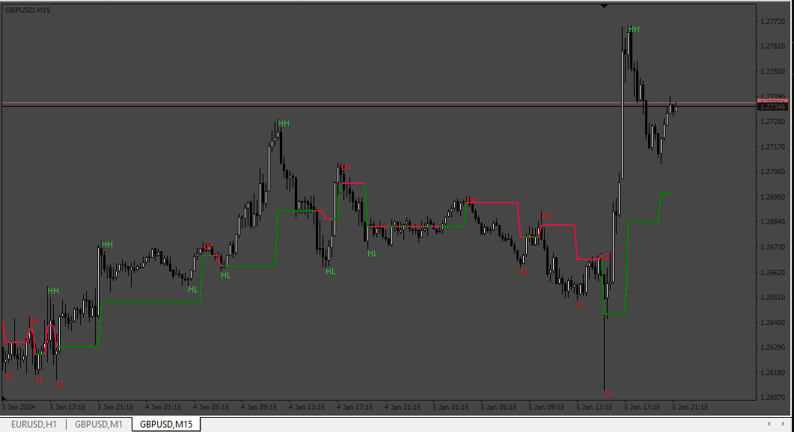

# HHLL_indicator

> Source: https://fxcodebase.com/code/viewtopic.php?f=38&t=74512  
> Forum: 38 · Topic 74512 · 4 post(s)

---

## HHLL_indicator

**Apprentice** · Sat Jan 06, 2024 2:08 am

Based on the request.
[https://fxcodebase.com/code/viewtopic.php?f=27&p=153797](https://fxcodebase.com/code/viewtopic.php?f=27&p=153797)

 [HHLL_indicator.mq4](files/153927/HHLL_indicator.mq4)

---

## Re: HHLL_indicator

**Teruyoshi** · Mon Jan 08, 2024 12:41 am

Thanks your for sharing this wonderful indicator.
Yet, I hesitate to say the pivotal line does not refresh automatically unless timeframe is changed.
 For now I use "change time frame.mq4" to deal with this. Is it possible to modify?
 Many thanks in advance

---

## Re: HHLL_indicator

**Apprentice** · Wed Jan 10, 2024 7:23 am

We have added your request to the development list.
Development reference 47

---

## Re: HHLL_indicator

**Apprentice** · Sat Jan 13, 2024 2:50 pm

[HHLL_indicator.mq4](files/154024/HHLL_indicator.mq4)

Try this version.
