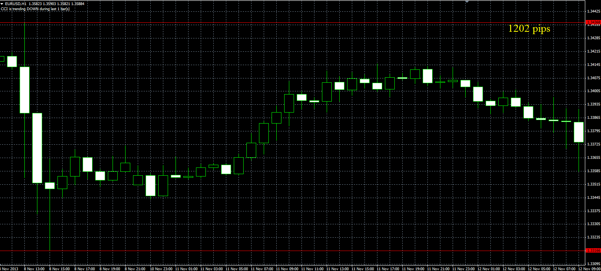

# Hi/Lo Line script

> Source: https://fxcodebase.com/code/viewtopic.php?f=38&t=60044  
> Forum: 38 · Topic 60044 · 1 post(s)

---

## Hi/Lo Line script

**Alexander.Gettinger** · Mon Dec 02, 2013 10:38 am

Original LUA indicator: [viewtopic.php?f=17&t=59801&p=90556](https://fxcodebase.com/code/viewtopic.php?f=17&t=59801&p=90556)

User can specify the prices for the top and bottom lines.

 

Download:

 [HiLo_Line.mq4](files/91293/HiLo_Line.mq4)
