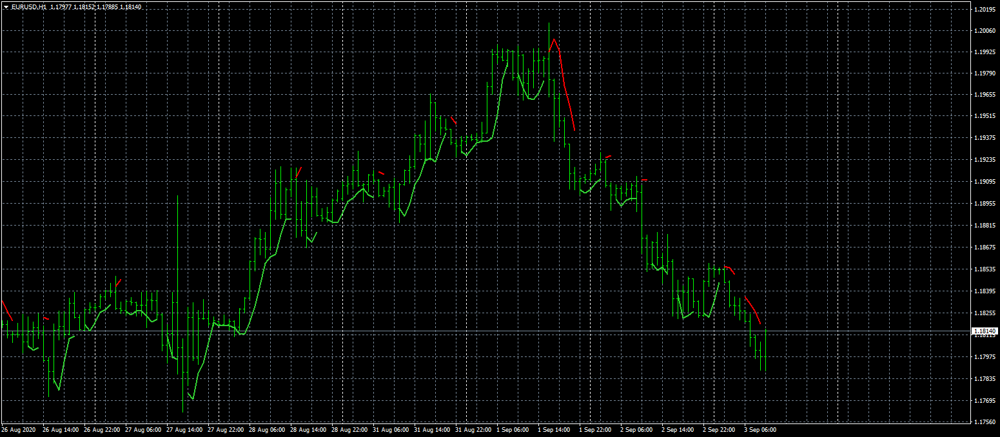
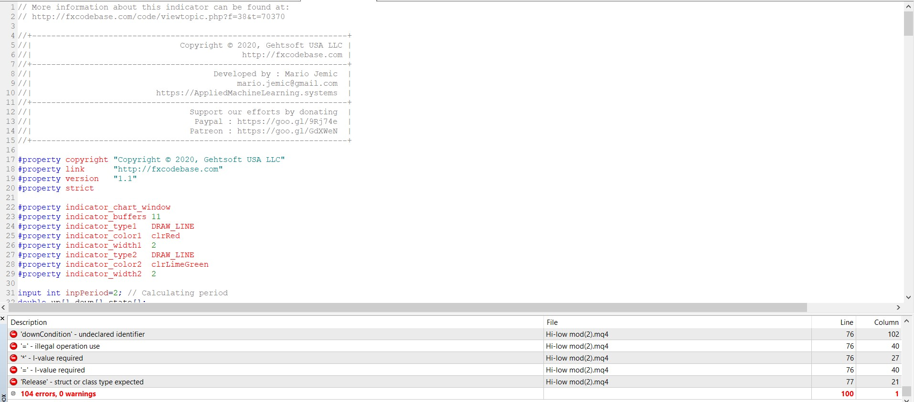
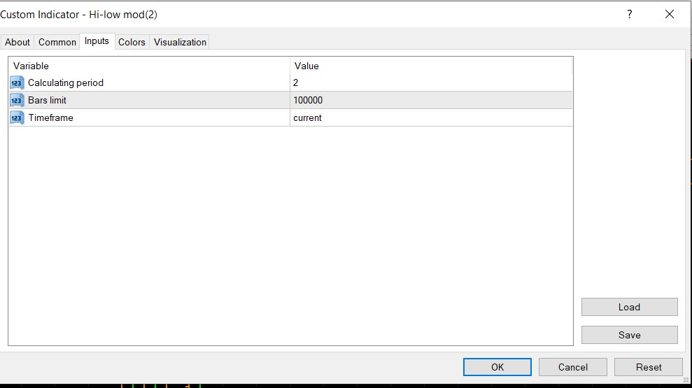

# Hi-low mod

> Source: https://fxcodebase.com/code/viewtopic.php?f=38&t=70370  
> Forum: 38 · Topic 70370 · 7 post(s)

---

## Hi-low mod

**Apprentice** · Thu Sep 03, 2020 2:25 am

Based on request.
[viewtopic.php?f=27&t=70286](https://fxcodebase.com/code/viewtopic.php?f=27&t=70286)

 [Hi-low mod.mq4](files/137267/Hi-low%20mod.mq4)

---

## Re: Hi-low mod

**IPAK++** · Tue Sep 15, 2020 1:31 am

Hi
thanks for this work
please add alarm too

---

## Re: Hi-low mod

**Apprentice** · Tue Sep 15, 2020 7:40 am

Your request is added to the development list.
Development reference 2033.

---

## Re: Hi-low mod

**IPAK++** · Thu Sep 17, 2020 1:06 am

thats not work

---

## Re: Hi-low mod

**Apprentice** · Thu Sep 17, 2020 2:13 am

Your request is added to the development list.
Development reference 2045.

---

## Re: Hi-low mod

**Apprentice** · Fri Sep 18, 2020 8:19 am

Fixed.

---

## Re: Hi-low mod

**IPAK++** · Fri Sep 18, 2020 10:33 am

The alarm section has not been added yet
