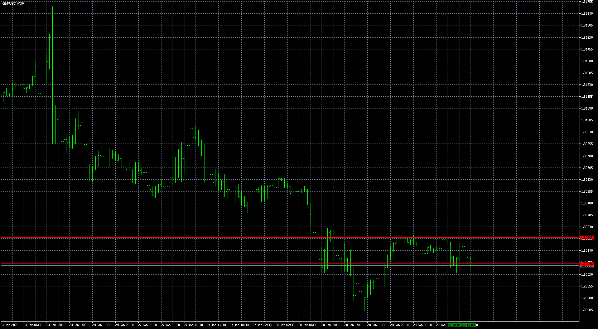

# Hiding_gap_volume

> Source: https://fxcodebase.com/code/viewtopic.php?f=38&t=69357  
> Forum: 38 · Topic 69357 · 6 post(s)

---

## Hiding_gap_volume

**Apprentice** · Wed Jan 29, 2020 7:43 am

Will draw the two lines on the candle with the highest volume.

 [Hiding_gap_volume.mq5](files/130959/Hiding_gap_volume.mq5)

---

## Re: Hiding_gap_volume

**aladdin007** · Wed Jan 29, 2020 10:09 am

Thank you so much

---

## Re: Hiding_gap_volume

**sydneygithinji** · Mon Mar 23, 2020 1:28 pm

Hi,
Create the hiding gap volume in mq4
Thanks

---

## Re: Hiding_gap_volume

**sydneygithinji** · Mon Mar 23, 2020 4:18 pm

Hi, can u create hiding gap volume for mq4,
Thanks

---

## Re: Hiding_gap_volume

**Apprentice** · Tue Mar 24, 2020 9:06 am

Your request is added to the development list.
Development reference 934.

---

## Re: Hiding_gap_volume

**Apprentice** · Thu Mar 26, 2020 7:01 am

Try this version.
[viewtopic.php?f=38&t=69203](https://fxcodebase.com/code/viewtopic.php?f=38&t=69203)
