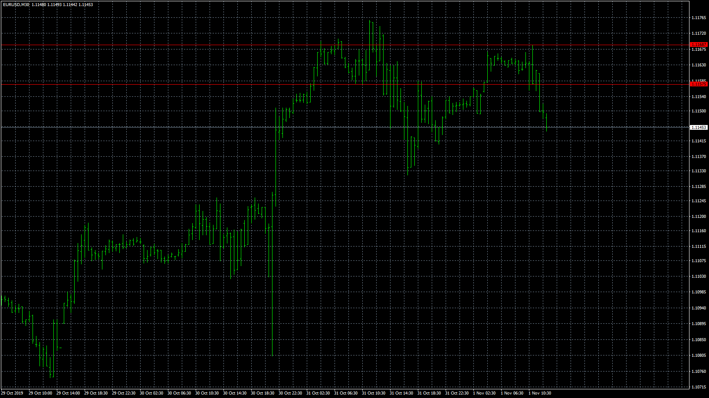

# Hiding_gap_volume

> Source: https://fxcodebase.com/code/viewtopic.php?f=38&t=69203  
> Forum: 38 · Topic 69203 · 20 post(s)

---

## Hiding_gap_volume

**Apprentice** · Fri Dec 06, 2019 2:33 pm

Based on request.
[viewtopic.php?f=38&t=69185](https://fxcodebase.com/code/viewtopic.php?f=38&t=69185)

 [Hiding_gap_volume.mq4](files/130118/Hiding_gap_volume.mq4)

---

## Re: Hiding_gap_volume

**aladdin007** · Sat Dec 07, 2019 5:05 am

Thank you so so much Mr Mario apprentice ,great work

---

## Re: Hiding_gap_volume

**aladdin007** · Sun Dec 15, 2019 8:36 am

Hi Mr Mario apprentice

Can you please modified this indicator to show just the day before high volume
I mean he will show just yesterday high volume with the time frame ,not the current day

Thank you so much

---

## Re: Hiding_gap_volume

**Apprentice** · Sun Dec 15, 2019 9:58 am

I'm not sure I understand,
can you clarify?

---

## Re: Hiding_gap_volume

**aladdin007** · Mon Dec 16, 2019 3:40 pm

HI Mr Mario Apprentice

thank you so much for the replay
on the picture p2 we have ultra higher volume look the red arrow but the indicator select another volume and candle and its not ultra higher look yellow arrow

on p1 picture can you make the indicator keep and not delete the last higher ands lower lines of the ultra higher volume as showing yellow color

its great work you did sir really
thank you so much

---

## Re: Hiding_gap_volume

**Apprentice** · Tue Dec 17, 2019 6:16 am

Your request is added to the development list.
Development reference 447.

---

## Re: Hiding_gap_volume

**Apprentice** · Wed Dec 18, 2019 5:09 pm

It depends on the periods used

---

## Re: Hiding_gap_volume

**aladdin007** · Wed Dec 18, 2019 8:19 pm

Thank you for the answer Mr mario apprentice

But how about the indicator keep the previous ultra high volume can you do it please
I give you example thendicator will give me the newest ultra high volume plus the previous ultra high volume

Thank you

---

## Re: Hiding_gap_volume

**Apprentice** · Thu Dec 19, 2019 11:31 am

Your request is added to the development list.
Development reference 453.

---

## Re: Hiding_gap_volume

**aladdin007** · Fri Dec 20, 2019 8:23 pm

Hir Mr Mario apprentice
The previous high volume with green line some time show up and some time not showing and it’s not showing in other time frame

I hope you can fix it thank you so much

---

## Re: Hiding_gap_volume

**Apprentice** · Tue Dec 24, 2019 6:58 am

[Hedging_with_Zone_Recovery_Area.lua](files/130428/Hedging_with_Zone_Recovery_Area.lua)

Try this version.

---

## Re: Hiding_gap_volume

**aladdin007** · Tue Dec 31, 2019 12:50 pm

hi Mr MARIO apprentice

---

## Re: Hiding_gap_volume

**aladdin007** · Wed Jan 22, 2020 8:31 pm

Hi Mr Mario apprentice

Can you make your indicator work for mt5

Thank you so much

---

## Re: Hiding_gap_volume

**Apprentice** · Thu Jan 23, 2020 11:46 am

Your request is added to the development list.
Development reference 583.

---

## Re: Hiding_gap_volume

**Apprentice** · Fri Jan 24, 2020 6:35 am

You can find MT5 version here.
[viewtopic.php?f=31&t=67418](https://fxcodebase.com/code/viewtopic.php?f=31&t=67418)

---

## Re: Hiding_gap_volume

**aladdin007** · Fri Jan 24, 2020 3:58 pm

Hi Mr Mario apprentice

Sorry i mean I want the indicator hiding gap the one who draw the two line red and green in chart of high volume ,I want for mt5

Thank you so much

---

## Re: Hiding_gap_volume

**Apprentice** · Sat Jan 25, 2020 7:48 am

Vertical line?

---

## Re: Hiding_gap_volume

**aladdin007** · Sat Jan 25, 2020 11:34 am

Yes vertical lines red and green
Thank you so much

---

## Re: Hiding_gap_volume

**Apprentice** · Sat Jan 25, 2020 3:41 pm

Something like volume pivots (TS2/Lua)
[viewtopic.php?f=17&t=2779](https://fxcodebase.com/code/viewtopic.php?f=17&t=2779)

Your request is added to the development list.
Development reference 594.

---

## Re: Hiding_gap_volume

**Apprentice** · Wed Jan 29, 2020 7:44 am

Try this version.
[viewtopic.php?f=38&t=69357](https://fxcodebase.com/code/viewtopic.php?f=38&t=69357)
