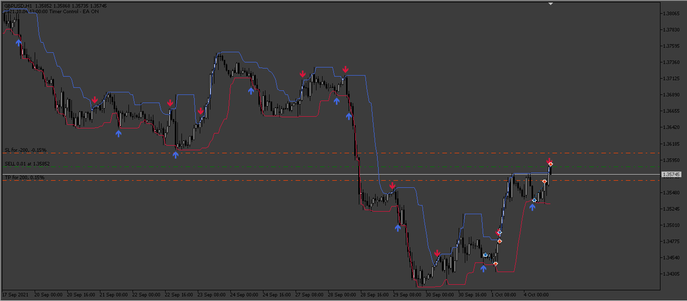

# High_Low_EA

> Source: https://fxcodebase.com/code/viewtopic.php?f=38&t=74516  
> Forum: 38 · Topic 74516 · 4 post(s)

---

## High_Low_EA

**Apprentice** · Sat Jan 06, 2024 2:58 am

Based on the request.
[https://fxcodebase.com/code/viewtopic.p ... 04#p153804](https://fxcodebase.com/code/viewtopic.php?f=17&p=153804#p153804)

 [High_Low_Indicator.mq4](files/153941/High_Low_Indicator.mq4)

 [Highs_Lows_EA.mq4](files/153941/Highs_Lows_EA.mq4)

 [High_Low_Indicator.mq5](files/153941/High_Low_Indicator.mq5)

 [High_Low_EA.mq5](files/153941/High_Low_EA.mq5)

---

## Re: High_Low_EA

**forexbutton** · Tue Feb 06, 2024 11:24 pm

hi apprendice ,

can u create this indicator for trading station

thank you.

---

## Re: High_Low_EA

**Apprentice** · Tue Feb 13, 2024 8:00 am

We have added your request to the development list.
Development reference 156

---

## Re: High_Low_EA

**Apprentice** · Tue Jun 10, 2025 5:02 am

TS2 version.
[https://fxcodebase.com/code/viewtopic.php?f=28&t=76023](https://fxcodebase.com/code/viewtopic.php?f=28&t=76023)
