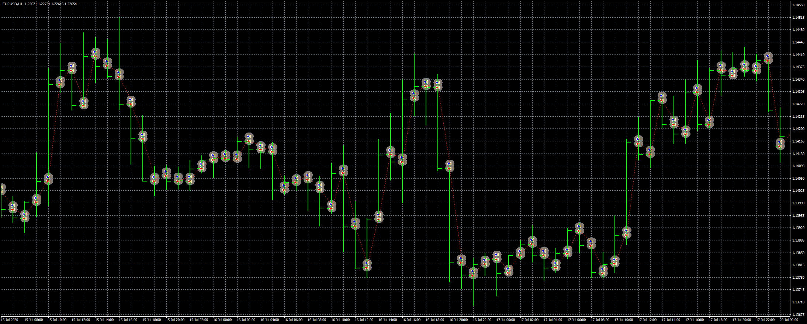
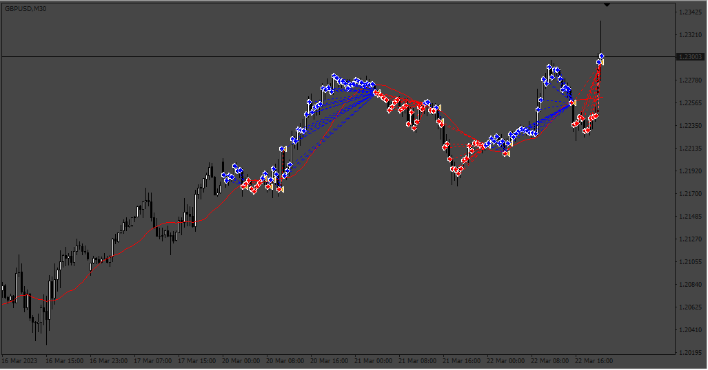

# High-Low_EA

> Source: https://fxcodebase.com/code/viewtopic.php?f=38&t=71441  
> Forum: 38 · Topic 71441 · 5 post(s)

---

## High-Low_EA

**Apprentice** · Mon Aug 23, 2021 2:13 am

Based on the request.
[https://fxcodebase.com/code/viewtopic.php?f=27&p=143237](https://fxcodebase.com/code/viewtopic.php?f=27&p=143237)

 [High-Low_EA.mq4](files/143312/High-Low_EA.mq4)

---

## Re: High-Low_EA

**Sensible** · Wed Sep 28, 2022 2:16 am

Hi Admin,

 I really appreciate the wonderful works the team of FXCodebase.com is doing here.

 When I applied this High-Low_EA to take a trade without the option of TakeProfit, StopLoss, Trailing Stop and BreakEven to close an open trade but to close all open trade at the opposite signal, I discover that it kept the trade opened.

 Please, can you make an adjustment to this EA by adding 20SMA to filter where to take a buy and a sell and also close all open trade at the opposite signal i.e price crossing over and below 20SMA for close open trade.

Can you please also explain the meaning, I want to understand what is the meaning and use of logic type: Direct and Reversal option.

 Thanks in advance.

---

## Re: High-Low_EA

**Apprentice** · Wed Sep 28, 2022 10:52 am

We have added your request to the development list.
Development reference 590.

---

## Re: High-Low_EA

**Muxy_trader** · Wed Oct 05, 2022 8:11 am

Hi Thank you very much for your Good work.. cheers!!!

---

## Re: High-Low_EA

**Apprentice** · Wed Jul 19, 2023 1:37 pm

 [High-Low_EA.mq4](files/151696/High-Low_EA.mq4)
