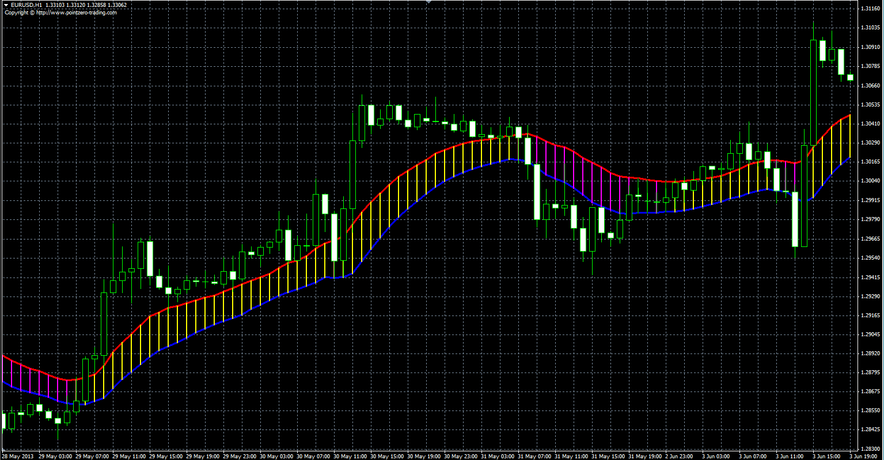

# High-Low moving average band

> Source: https://fxcodebase.com/code/viewtopic.php?f=38&t=40835  
> Forum: 38 · Topic 40835 · 3 post(s)

---

## High-Low moving average band

**Alexander.Gettinger** · Thu Jun 13, 2013 11:23 am

The indicator draws the band bounded by two moving averages (for High and Low prices).

TS2/Marketscope version.
[viewtopic.php?f=17&t=66114](https://fxcodebase.com/code/viewtopic.php?f=17&t=66114)

 

Download:

 [HL_MA_Band.mq4](files/66864/HL_MA_Band.mq4)

---

## Re: High-Low moving average band

**bartwas1** · Wed May 09, 2018 8:37 am

Hi Alexander,

Is there written in lua a version of meta trader's indicator - high-low moving average band - based on the one you'd created? I've looked in the forum, but I couldn't located it.
My second question is if you ever made this high-low moving average band with selectable choice of MAs, especially volume adjusted MA?

Bart

---

## Re: High-Low moving average band

**Apprentice** · Thu May 10, 2018 4:47 am

Try this version.
[viewtopic.php?f=17&t=66114](https://fxcodebase.com/code/viewtopic.php?f=17&t=66114)
