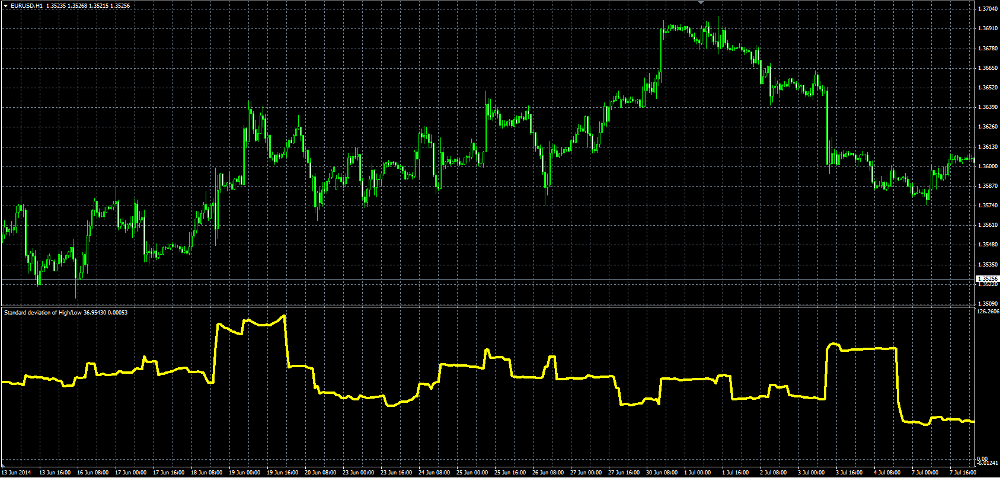

# High/Low standard deviation oscillator

> Source: https://fxcodebase.com/code/viewtopic.php?f=38&t=60980  
> Forum: 38 · Topic 60980 · 1 post(s)

---

## High/Low standard deviation oscillator

**Alexander.Gettinger** · Sun Jul 27, 2014 11:26 am

Formula:
HL_StdDev = Standard Deviation (HL), where
HL = High-Low.

 

Download:

 [HL_StdDev.mq4](files/95138/HL_StdDev.mq4)
