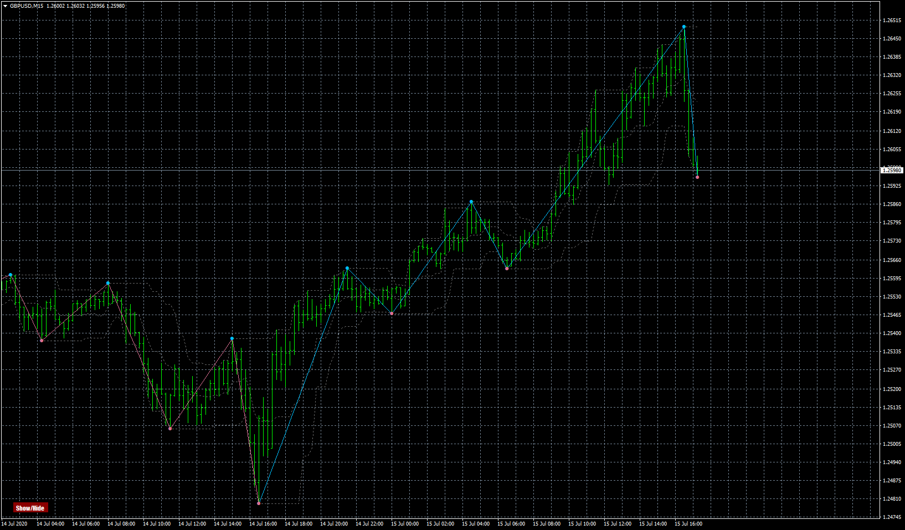

# High - low trend 3.01(mtf + alerts)

> Source: https://fxcodebase.com/code/viewtopic.php?f=38&t=70182  
> Forum: 38 · Topic 70182 · 3 post(s)

---

## High - low trend 3.01(mtf + alerts)

**Apprentice** · Wed Jul 15, 2020 11:09 am

 [High - low trend 3.01(mtf + alerts).mq4](files/136004/High%20-%20low%20trend%203.01%28mtf%20alerts%29.mq4)

---

## Re: High - low trend 3.01(mtf + alerts)

**SANTOSH** · Wed Jul 20, 2022 9:09 am

Dear Apprentice ,
Can you code the lua version for the same indicator ?

Regards ,
Santosh .

---

## Re: High - low trend 3.01(mtf + alerts)

**Apprentice** · Wed Jul 20, 2022 10:52 am

We have added your request to the development list.
Development reference 439.
