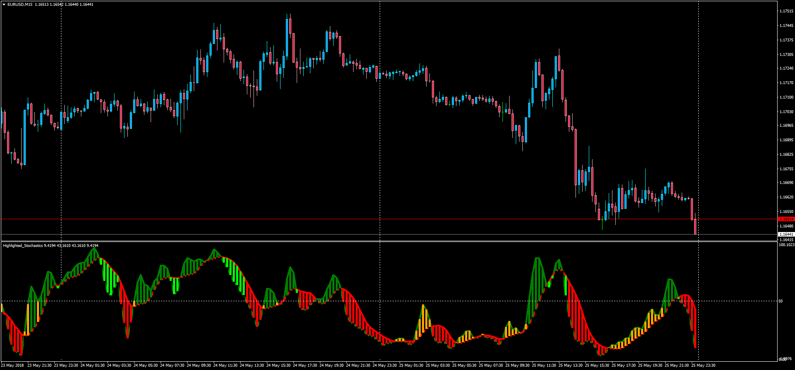

# Highlighted Stochastic with Alert

> Source: https://fxcodebase.com/code/viewtopic.php?f=38&t=66153  
> Forum: 38 · Topic 66153 · 1 post(s)

---

## Highlighted Stochastic with Alert

**Apprentice** · Sun May 27, 2018 6:35 pm

LUA Original: [viewtopic.php?f=17&t=62636](https://fxcodebase.com/code/viewtopic.php?f=17&t=62636)

Description:

This is the MT4 version of the LUA original oscillator that highlights the position of K in regards of D within the Stochastic indicator. It includes an optional alert when the color changes.

 [Highlighted_Stochastics.mq4](files/119374/Highlighted_Stochastics.mq4)
