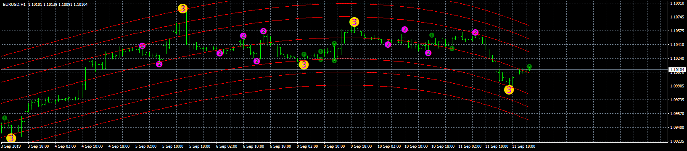

# Highly_adaptable_Belkhayate_s_Center_Of_Gravity_Strategy.MCT

> Source: https://fxcodebase.com/code/viewtopic.php?f=38&t=68930  
> Forum: 38 · Topic 68930 · 1 post(s)

---

## Highly_adaptable_Belkhayate_s_Center_Of_Gravity_Strategy.MCT

**Apprentice** · Wed Sep 18, 2019 6:09 am

TS2/Lua version.
[viewtopic.php?f=31&t=26099](https://fxcodebase.com/code/viewtopic.php?f=31&t=26099)

 [Highly_adaptable_Belkhayate_s_Center_Of_Gravity_Strategy.MCTrendTrader.mq4](files/128741/Highly_adaptable_Belkhayate_s_Center_Of_Gravity_Strategy.MCTrendTrader.mq4)

You can download BELCOG.mq4 here.
[viewtopic.php?f=38&t=68929](https://fxcodebase.com/code/viewtopic.php?f=38&t=68929)
You can download Semaphor_3Level_ZZ.mq4 here.
[viewtopic.php?f=38&t=65061](https://fxcodebase.com/code/viewtopic.php?f=38&t=65061)
