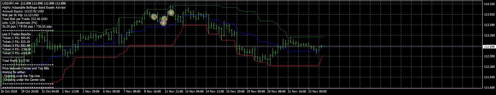
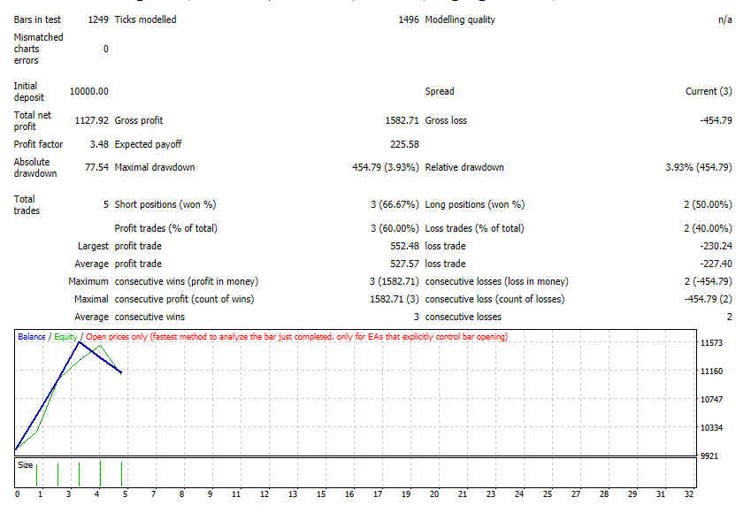

# Highly Adaptable Donchian Channel EA

> Source: https://fxcodebase.com/code/viewtopic.php?f=38&t=67009  
> Forum: 38 · Topic 67009 · 5 post(s)

---

## Highly Adaptable Donchian Channel EA

**Apprentice** · Mon Nov 26, 2018 5:39 am

 

 [Highly Adaptable Donchian Channel EA.mq4](files/122354/Highly%20Adaptable%20Donchian%20Channel%20EA.mq4)

Based on DNC.mq4
[viewtopic.php?f=38&t=62193](https://fxcodebase.com/code/viewtopic.php?f=38&t=62193)
Based on request.
[viewtopic.php?f=27&t=66964](https://fxcodebase.com/code/viewtopic.php?f=27&t=66964)

---

## Re: Highly Adaptable Donchian Channel EA

**ciclon** · Tue Jul 30, 2019 12:40 pm

Hi Apprentice,
I am somewhat confused.
The title of this post and the name of the file refer to the "Donchian Channel", but the text on the screen and the alerts refer to the "Bollinger Bands".
Which one is correct ???
Thank you.

---

## Re: Highly Adaptable Donchian Channel EA

**Apprentice** · Thu Aug 01, 2019 11:10 am

Fixed.

---

## Re: Highly Adaptable Donchian Channel EA

**fourari69** · Mon Oct 25, 2021 8:32 am

Dear Apprentice, hello, is there any way you can add stop time and end time to this EA.
Thank you very much

---

## Re: Highly Adaptable Donchian Channel EA

**Apprentice** · Tue Oct 26, 2021 4:07 am

Your request is added to the development list.
Development reference 934.
