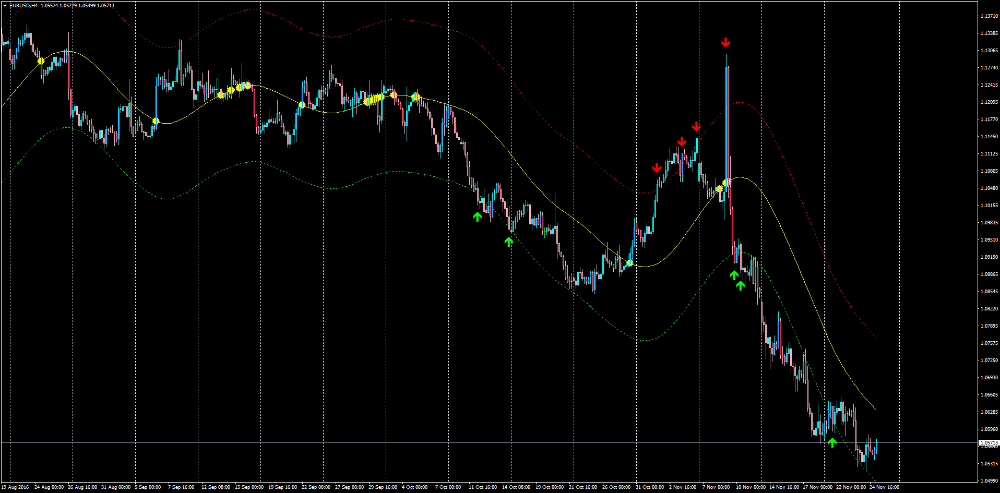

# Highly Adaptable Moving Average Alerts

> Source: https://fxcodebase.com/code/viewtopic.php?f=38&t=64139  
> Forum: 38 · Topic 64139 · 1 post(s)

---

## Highly Adaptable Moving Average Alerts

**Apprentice** · Fri Nov 25, 2016 6:47 am

Description:
This indicator allows you to select from a large number of Moving Averages, Price Types and Envelopes to be alerted via sound/display and/or email when a crossing occurs.

 [Highly_Adaptable_MA_Alerts.mq4](files/109206/Highly_Adaptable_MA_Alerts.mq4)

Based on TS2/Marketscope strategy
[viewtopic.php?f=31&t=59802](https://fxcodebase.com/code/viewtopic.php?f=31&t=59802)
