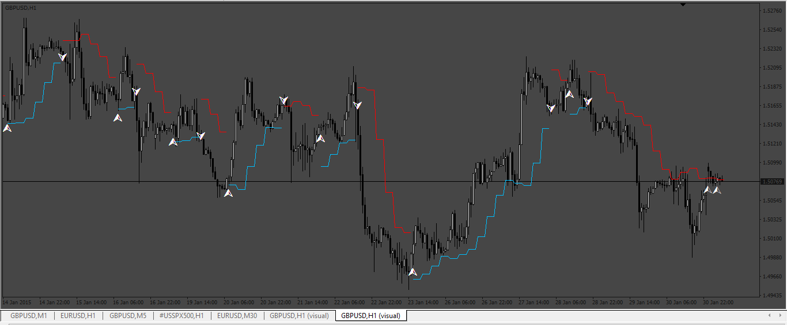
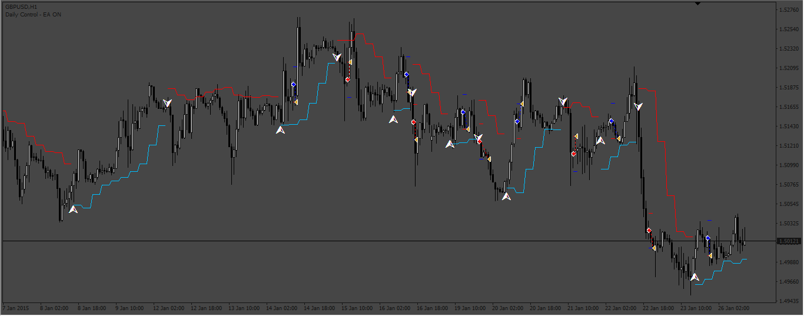

# hilo-activator-profi

> Source: https://fxcodebase.com/code/viewtopic.php?f=38&t=73640  
> Forum: 38 · Topic 73640 · 14 post(s)

---

## hilo-activator-profi

**Apprentice** · Sun Apr 23, 2023 2:45 pm

Based on the request.
[https://fxcodebase.com/code/viewtopic.php?f=27&t=73270](https://fxcodebase.com/code/viewtopic.php?f=27&t=73270)

 [hilo-activator-profi.mq4](files/150562/hilo-activator-profi.mq4)

---

## Re: hilo-activator-profi

**quintana** · Tue Apr 25, 2023 4:57 am

possible to make an ea with this indicator ?
thanks

---

## Re: hilo-activator-profi

**Apprentice** · Wed Apr 26, 2023 1:29 pm

We have added your request to the development list.
Development reference 370.

---

## Re: hilo-activator-profi

**ForzaMagicaRoma** · Thu Apr 27, 2023 10:42 am

Hi I'm new here. I respect you very much for your work.

Is it possible to make an advisor who simply opens at a signal and closes and reopens at the opposite signal of this indicator?

A donation would be the minimum.

Thank you

---

## Re: hilo-activator-profi

**Apprentice** · Mon May 01, 2023 3:51 am

Task 370

 [hilo-activator-profi.mq4](files/150633/hilo-activator-profi.mq4)

 [Hilo_Activator_Profit_EA_MT4.mq4](files/150633/Hilo_Activator_Profit_EA_MT4.mq4)

---

## Re: hilo-activator-profi

**Apprentice** · Mon May 01, 2023 5:33 am

We have added your request to the development list.
Development reference 388.

---

## Re: hilo-activator-profi

**quintana** · Mon May 01, 2023 12:14 pm

close all in opposite signal : not work for me(with not error message)
(seems good on eurusd without this fonction)
thanks

---

## Re: hilo-activator-profi

**ForzaMagicaRoma** · Mon May 01, 2023 10:36 pm

> **Apprentice wrote:**
>
>
> 370pic.png
>
>
> Task 370
>
>
> hilo-activator-profi.mq4
>
>
>
>
> Hilo_Activator_Profit_EA_MT4.mq4

Thanks for the work done.
However, the advisor does not create any trades.
Is it possible to verify?
I thank

---

## Re: hilo-activator-profi

**Apprentice** · Wed May 03, 2023 6:20 pm

Task 388

 [hilo-activator-profi.mq4](files/150691/hilo-activator-profi.mq4)

 [Gann_HiLo_activator_bars_candle.mq4](files/150691/Gann_HiLo_activator_bars_candle.mq4)

 [Hilo_EA_v1.00.mq4](files/150691/Hilo_EA_v1.00.mq4)

---

## Re: hilo-activator-profi

**quintana** · Thu May 04, 2023 3:40 am

> **Apprentice wrote:**
> Task 388
>
>
> hilo-activator-profi.mq4
>
>
>
>
> Gann_HiLo_activator_bars_candle.mq4
>
>
>
>
> Hilo_EA_v1.00.mq4

Can you set the value of the Gann indicator's : Lib as an external variable? It's important to be able to test it. Thank you.

---

## Re: hilo-activator-profi

**Apprentice** · Sun May 07, 2023 4:57 am

We have added your request to the development list.
Development reference 414.

---

## Re: hilo-activator-profi

**quintana** · Fri Jul 14, 2023 1:37 pm

> **quintana wrote:**
>
>
> > **Apprentice wrote:**
> > Task 388
> >
> >
> > The attachment **hilo-activator-profi.mq4** is no longer available
> >
> >
> >
> >
> > The attachment **hilo-activator-profi.mq4** is no longer available
> >
> >
> >
> >
> > The attachment **hilo-activator-profi.mq4** is no longer available
>
>
> Can you set the value of the Gann indicator's : Lib as an external variable? It's important to be able to test it. Thank you.

put Lbglobal on variables globales
for control Lb variable of indicator in bactesting
and try this

---

## Re: hilo-activator-profi

**Apprentice** · Fri Aug 25, 2023 2:03 am

Something like this?

 [Hilo_EA_v1.00.mq4](files/152226/Hilo_EA_v1.00.mq4)

---

## Re: hilo-activator-profi

**llllllllollllllll** · Mon Jan 29, 2024 1:16 pm

its repaint
