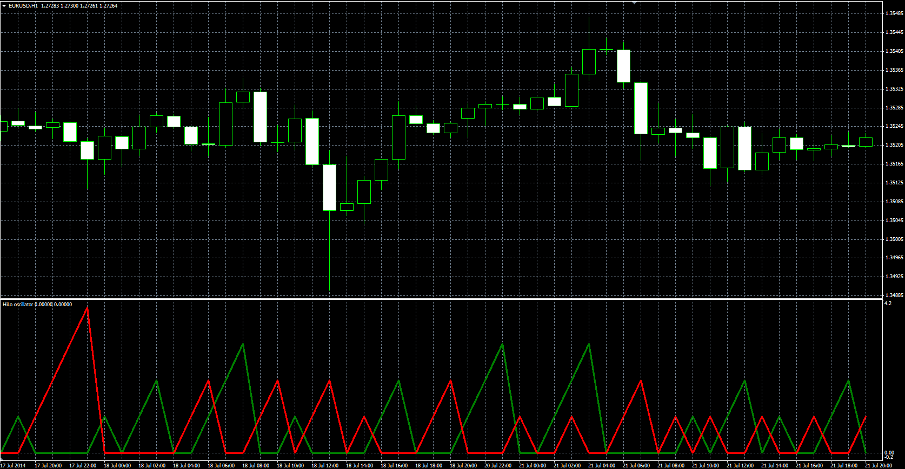

# HiLo oscillator

> Source: https://fxcodebase.com/code/viewtopic.php?f=38&t=61385  
> Forum: 38 · Topic 61385 · 1 post(s)

---

## HiLo oscillator

**Alexander.Gettinger** · Mon Oct 27, 2014 10:41 am

Original LUA oscillator: [viewtopic.php?f=17&t=24006](https://fxcodebase.com/code/viewtopic.php?f=17&t=24006).

Formulas:
Hi[i] = Hi[i-1]+1, if High[i]>High[i-1], else Hi[i]=0,
Lo[i] = Lo[i-1]+1, if Low[i]<Low[i-1], else Lo[i]=0.

 

Download:

 [HiLo.mq4](files/96759/HiLo.mq4)
