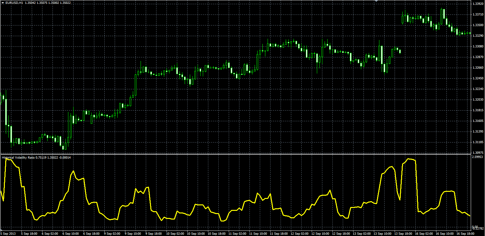

# Historical Volatility Ratio oscillator

> Source: https://fxcodebase.com/code/viewtopic.php?f=38&t=59982  
> Forum: 38 · Topic 59982 · 4 post(s)

---

## Historical Volatility Ratio oscillator

**Alexander.Gettinger** · Tue Nov 26, 2013 3:23 pm

Formulas:
HVR = StdDev1/StdDev2, where
StdDev1 - standard deviation with Period1,
StdDev2 - standard deviation with Period2.

 

Download:

 [HVR.mq4](files/91135/HVR.mq4)

---

## Re: Historical Volatility Ratio oscillator

**Jeffreyvnlk** · Sat Aug 23, 2014 5:34 am

> **Alexander.Gettinger wrote:**
> Formulas:
> HVR = StdDev1/StdDev2, where
> StdDev1 - standard deviation with Period1,
> StdDev2 - standard deviation with Period2.
>
>
>
> HVR_MQL.PNG
>
>
>
> Download:
>
>
> HVR.mq4

In the book Smart Street Linda Bradford Raschee gave a strategy based on HVR. Could you give a version for fxcm's platform. It perfect if just displaying a number on the corner of the chart for yesterday reading not today. Or an arrow with a threshold, according to her when HVR smaller than 50%, that the set up. Otherwise just a line underneath of the chart as usual

---

## Re: Historical Volatility Ratio oscillator

**Apprentice** · Sun Aug 24, 2014 4:42 am

U can found TS2/Marketscope version here
[viewtopic.php?f=17&t=59981&p=91136&hilit=Historical+Volatility+Ratio+oscillator#p91136](https://fxcodebase.com/code/viewtopic.php?f=17&t=59981&p=91136&hilit=Historical+Volatility+Ratio+oscillator#p91136)

Can u please define stategy rules.

---

## Re: Historical Volatility Ratio oscillator

**Jeffreyvnlk** · Tue Sep 02, 2014 3:01 am

> **Apprentice wrote:**
> U can found TS2/Marketscope version here
> [viewtopic.php?f=17&t=59981&p=91136&hilit=Historical+Volatility+Ratio+oscillator#p91136](https://fxcodebase.com/code/viewtopic.php?f=17&t=59981&p=91136&hilit=Historical+Volatility+Ratio+oscillator#p91136)
>
> Can u please define stategy rules.

Many thanks
