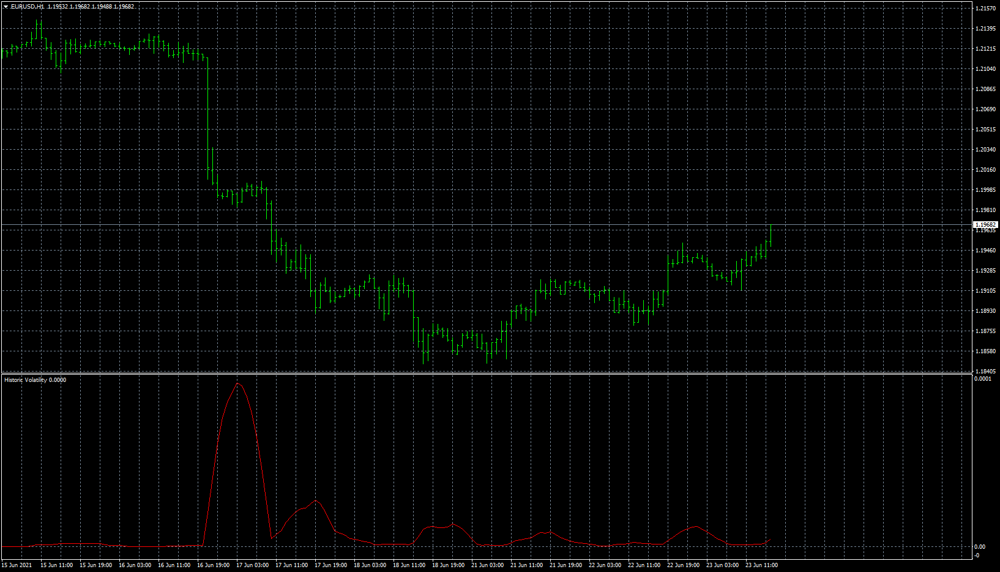

# HistoricVolatility

> Source: https://fxcodebase.com/code/viewtopic.php?f=38&t=71288  
> Forum: 38 · Topic 71288 · 1 post(s)

---

## HistoricVolatility

**Apprentice** · Wed Jun 23, 2021 8:59 am

As Standard Deviation Of Moving Average

 [HistoricVolatility.mq4](files/142581/HistoricVolatility.mq4)
