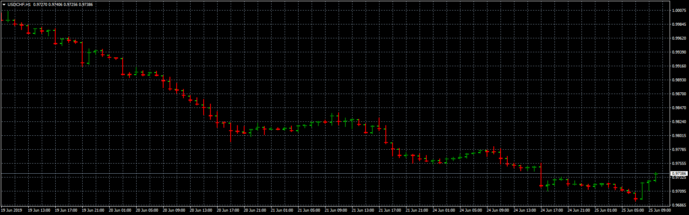

# HLC

> Source: https://fxcodebase.com/code/viewtopic.php?f=38&t=68600  
> Forum: 38 · Topic 68600 · 10 post(s)

---

## HLC

**Apprentice** · Tue Jun 25, 2019 4:35 am

 [HLC.mq4](files/127089/HLC.mq4)

---

## Re: HLC

**logicgate** · Tue Jun 25, 2019 9:19 am

Thanks my friend

---

## Re: HLC

**logicgate** · Sat Aug 17, 2019 8:57 am

I have tried it now, does not look good mate, not clean, I can still see the open and the close crossing the bar is not good. Can you make it look like those ones here:

[https://www.mql5.com/pt/market/product/29203](https://www.mql5.com/pt/market/product/29203)

[https://www.mql5.com/pt/market/product/40770](https://www.mql5.com/pt/market/product/40770)

---

## Re: HLC

**Apprentice** · Mon Aug 19, 2019 6:29 am

It's impossible in MT4.

---

## Re: HLC

**logicgate** · Mon Aug 19, 2019 1:29 pm

It is totally possible, those two indicators here are for MT4:

[https://www.mql5.com/pt/market/product/40770](https://www.mql5.com/pt/market/product/40770)

[https://www.mql5.com/en/market/product/25986](https://www.mql5.com/en/market/product/25986)

---

## Re: HLC

**logicgate** · Mon Aug 19, 2019 2:04 pm

Deleted post, this dada HLC indi is crap.

---

## Re: HLC

**logicgate** · Mon Aug 19, 2019 7:04 pm

I have found this indicator here, this guy is like 95% percent there, take a look at the code and you will figure it out.

The only problem is when you zoom into the bars then they look a bit weird and you can still see the open.

Make sure you set all timeframes bundles to 1.

---

## Re: HLC

**logicgate** · Mon Aug 19, 2019 9:37 pm

I was able to configure the ipolo hlc bars I posted here to 98% how I wanted, if you set the chart as a line chart and make it the same color of the background to make it disappear, then untick the box "chart of foreground" then it will look like the screenshot I posted here. So you can see that is possible to have the HLC bars as I asked. Check the second screenshot, I tried my best to paint black a little bit of the close line, that is how I wanted it to look, to have some separation so that the bars don´t look glued to each other. Perhaps it is there in the code the length of the close, you could tweak it to make it just a little bit smaller.

---

## Re: HLC

**Apprentice** · Tue Aug 20, 2019 6:21 am

I can NOT read EX4 files.

---

## Re: HLC

**logicgate** · Tue Aug 20, 2019 8:08 am

Oh crap, I forgot about that... I will try find the .mq4 file. But you can see how it is possible to code an indi like this.
