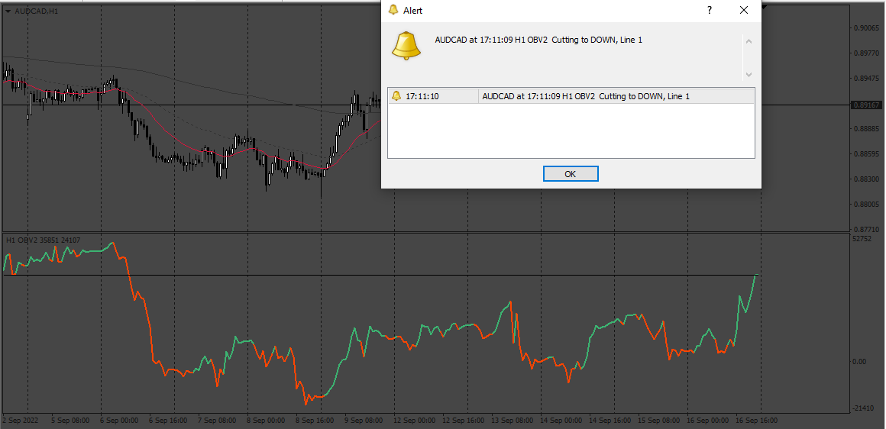

# hLine

> Source: https://fxcodebase.com/code/viewtopic.php?f=38&t=72736  
> Forum: 38 · Topic 72736 · 9 post(s)

---

## hLine

**Apprentice** · Wed Sep 21, 2022 1:52 am

Based on the request.
[https://fxcodebase.com/code/viewtopic.php?f=27&p=147346](https://fxcodebase.com/code/viewtopic.php?f=27&p=147346)

 [hLine.mq4](files/147518/hLine.mq4)

---

## Re: hLine

**branesuraj** · Wed Sep 21, 2022 8:21 am

there is a problem here the level is changing repeatedly i think it will not be possible to do it with price level because the price level will change again and again ,
according to me, a horizontal line will come out from the anchor point,exact date and time and if that horizontal line is touched then i wanted an alert

and yes,thanks,i see you have worked hard.

---

## Re: hLine

**Apprentice** · Fri Sep 23, 2022 10:41 am

We have added your request to the development list.
Development reference 575.

---

## Re: hLine

**branesuraj** · Thu Sep 29, 2022 8:44 am

> **Apprentice wrote:**
> We have added your request to the development list.
> Development reference 575.

It would be better to see if it is really possible

---

## Re: hLine

**branesuraj** · Thu Oct 06, 2022 7:33 pm

I hope you can do it take a look once

---

## Re: hLine

**branesuraj** · Thu Nov 03, 2022 7:06 am

> **Apprentice wrote:**
> We have added your request to the development list.
> Development reference 575.

I don't need the alert can you make one with this line so that my horizontal line with exact date and time float all the time with this line

---

## Re: hLine

**Apprentice** · Fri Nov 04, 2022 3:30 am

We have added your request to the development list.
Development reference 706.

---

## Re: hLine

**Apprentice** · Tue Nov 08, 2022 6:48 am

[hLine.mq4](files/148215/hLine.mq4)

Try this version.

---

## Re: hLine

**branesuraj** · Tue Nov 08, 2022 3:25 pm

> **Apprentice wrote:**
>
>
> hLine.mq4
>
>
> Try this version.

Not working the level is changing repeatedly i think it will not be possible to do it with price level because the price level will change again and again. i wanted the horizontal level to follow this line or flot,but level keeps changing.
