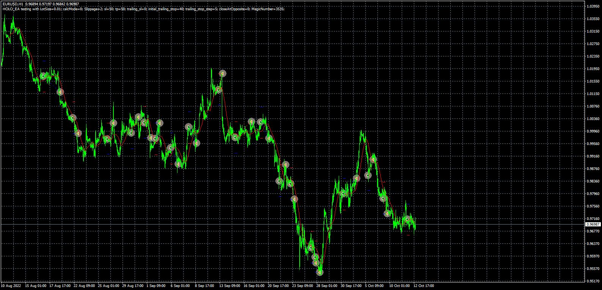

# HOLO_EA

> Source: https://fxcodebase.com/code/viewtopic.php?f=38&t=72838  
> Forum: 38 · Topic 72838 · 4 post(s)

---

## HOLO_EA

**Apprentice** · Wed Oct 12, 2022 1:53 pm

Based on the request.
[https://fxcodebase.com/code/viewtopic.php?f=27&p=147832](https://fxcodebase.com/code/viewtopic.php?f=27&p=147832)

 [HOLO_EA.mq4](files/147893/HOLO_EA.mq4)

---

## Re: HOLO_EA

**Sensible** · Sun Oct 16, 2022 10:54 am

Hi Apprentice and the team of Fxcodebase,

Thanks for the well done job on the development of this EA....I am sincerely grateful.

Please, I need a little adjustment and correction on it, although it working according to my early specification but I still need some correction to make it perfect for my strategy.

**Area of corrections:**
1. I need the 20SMA for filter to appear on the input parameter so that I can Adjust & Change it's Period to lower or higher Period.

2. I want to be able to set the TakeProfit & Stoploss to True/False

3. I want you help me include the option of the Numbers of open trade in the input parameter.

4. I want an adjustment on the Exit of Open trade:

**Open Sell Exit:**
The entry for open sell trade should still remain the same; Open Sell Order when OPEN=HIGH and Price is Below 20SMA and it Exit Open trade at TakeProfit specified but if price fail to reach Takeprofit then close all Open Sell trade at when price Close & Open ABOVE 20SMA.

**Open Buy Exit:**
The entry for open buy trade should still remain the same Open Buy Order when OPEN=LOW and Price is Above 20SMA and it Exit Open trade at TakeProfit specified but if price fail to reach Takeprofit then close all Open Buy trade at when price Close & Open BELOW 20SMA.

I will appreciate it, if the correction can be done to it.

Thanks in advance.

---

## Re: HOLO_EA

**Apprentice** · Tue Oct 18, 2022 2:00 am

We have added your request to the development list.
Development reference 660.

---

## Re: HOLO_EA

**Apprentice** · Thu Oct 20, 2022 2:17 am

Try this version.

 [HOLO_EA.mq4](files/147978/HOLO_EA.mq4)
