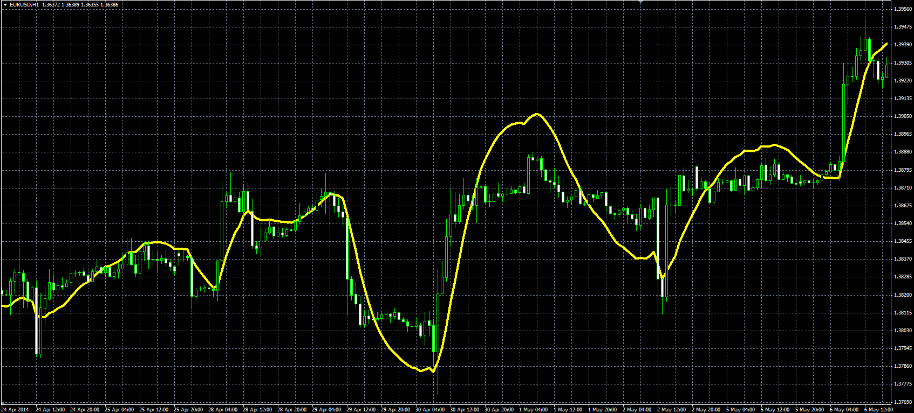
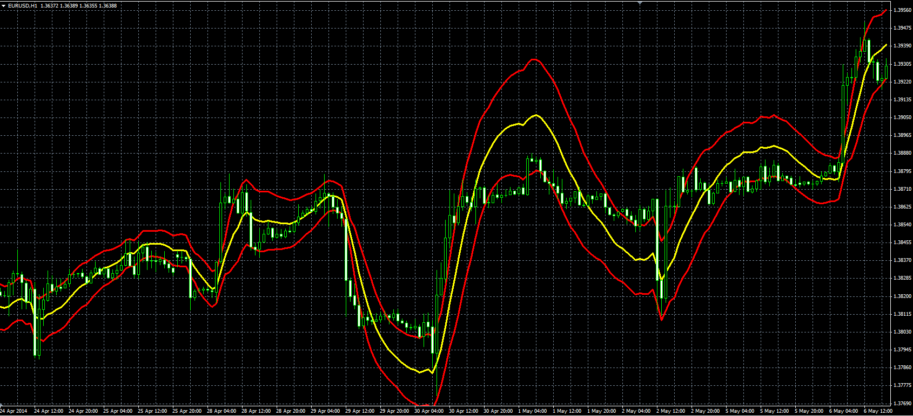

# Holt-Winter Moving Average

> Source: https://fxcodebase.com/code/viewtopic.php?f=38&t=60802  
> Forum: 38 · Topic 60802 · 1 post(s)

---

## Holt-Winter Moving Average

**Alexander.Gettinger** · Fri Jun 06, 2014 3:58 pm

Original LUA indicators: [viewtopic.php?f=17&t=33313](https://fxcodebase.com/code/viewtopic.php?f=17&t=33313).

Formulas:
HWMA[i] = F[i]+V[i]+0.5*A[i], where
F[i] = (1-a)*(F[i-1]+V[i-1]+0.5*A[i-1])+a*Price[i],
V[i] = (1-b)*(V[i-1]+A[i-1])+b*(F[i]-F[i-1]),
A[i] = (1-c)*A[i-1]+c*(V[i]-V[i-1]).

 

Download:

 [HVMA.mq4](files/94385/HVMA.mq4)

**Holt-Winter Channel**

Formulas:
Top = HWMA+Multiplier*StDt,
Bottom = HWMA-Multiplier*StDt, where
HWMA - Holt-Winter Moving Average,
StDt[i] = Sqrt(Var[i-1]),
Var[i] = (1-d)*Var[i-1]+d*(Price[i-1]-HWMA[i-1])*(Price[i-1]-HWMA[i-1]).

 

Download:

 [HVC.mq4](files/94385/HVC.mq4)
