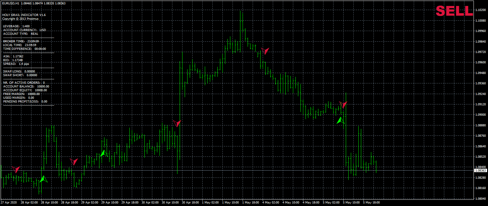
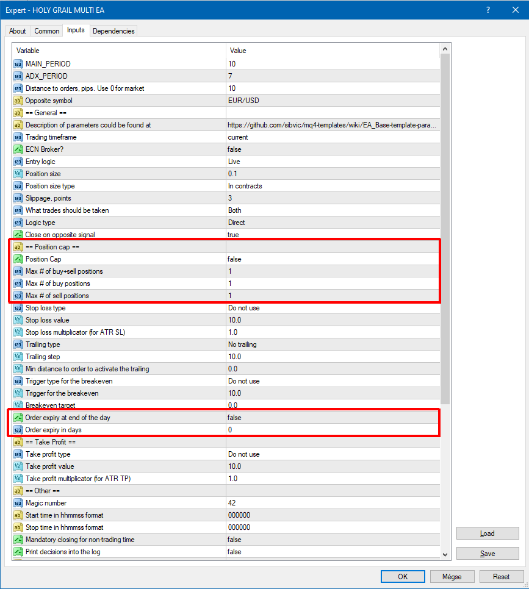

# HOLY GRAIL EA

> Source: https://fxcodebase.com/code/viewtopic.php?f=38&t=70281  
> Forum: 38 · Topic 70281 · 26 post(s)

---

## HOLY GRAIL EA

**Apprentice** · Tue Aug 11, 2020 4:06 am

Based on request.
[viewtopic.php?f=27&t=70263](https://fxcodebase.com/code/viewtopic.php?f=27&t=70263)

 [HOLY GRAIL 1.6.mq4](files/136768/HOLY%20GRAIL%201.6.mq4)

 [HOLY GRAIL EA.mq4](files/136768/HOLY%20GRAIL%20EA.mq4)

 [HOLY GRAIL.mq5](files/136768/HOLY%20GRAIL.mq5)

 [HOLY GRAIL EA.mq5](files/136768/HOLY%20GRAIL%20EA.mq5)

---

## Re: HOLY GRAIL EA

**gosc007** · Thu Aug 13, 2020 11:17 pm

Can You Please Convert it EA and indycator to MT5?:)

---

## Re: HOLY GRAIL EA

**Apprentice** · Fri Aug 14, 2020 5:31 am

Your request is added to the development list.
Development reference 1886.

---

## Re: HOLY GRAIL EA

**Apprentice** · Sat Sep 05, 2020 3:12 am

MT5 version added.

---

## Re: HOLY GRAIL EA

**ElectricSavant** · Mon Oct 19, 2020 9:36 pm

This does not trade.

I found this

- You can get a key via @profit_robots_bot Telegram Bot. Visit ProfitRobots.com for disc

---

## Re: HOLY GRAIL EA

**Apprentice** · Tue Oct 20, 2020 2:24 am

Your request is added to the development list.
Development reference 2203.

---

## Re: HOLY GRAIL EA

**ElectricSavant** · Tue Oct 20, 2020 7:48 am

My mistake. It trades.

---

## Re: HOLY GRAIL EA

**Chonde** · Fri Feb 19, 2021 8:46 pm

Sir,

I am very interested in this ea.

Please add options for pending orders (stop or limit orders) xxx pips from live signal price.

And xxx pips can be manually set

And I hope to do both at the same time.

Thanks

---

## Re: HOLY GRAIL EA

**Apprentice** · Sat Feb 20, 2021 3:04 pm

Your request is added to the development list.
Development reference 218.

---

## Re: HOLY GRAIL EA

**Apprentice** · Tue Feb 23, 2021 2:33 am

Task 218
Try this version.

 [HOLY GRAIL EA.mq4](files/140894/HOLY%20GRAIL%20EA.mq4)

---

## Re: HOLY GRAIL EA

**Chonde** · Fri Feb 26, 2021 11:51 pm

Thank you apprentice

I will try it

---

## Re: HOLY GRAIL EA

**feyyaz** · Tue Mar 02, 2021 4:22 pm

Can you add in the mt4 ea code pleas more than one forex pair. The ea work not when i buy eur/usd i cant paralel sell command usd/jpy than its open short usd/jpy and paralel send the ea to eur/usd sell and it closed. Can you add variables to the pairs so we can trade more than one pair paralel.

Thanks

---

## Re: HOLY GRAIL EA

**Apprentice** · Wed Mar 03, 2021 12:52 pm

Your request is added to the development list.
Development reference 244.

---

## Re: HOLY GRAIL EA

**Apprentice** · Thu Mar 04, 2021 1:00 pm

[HOLY GRAIL MULTI EA.mq4](files/141049/HOLY%20GRAIL%20MULTI%20EA.mq4)

Try this version.

---

## Re: HOLY GRAIL EA

**makomajor** · Fri Sep 23, 2022 5:14 am

Hello Dear Coders,

 Could you please add Number of Trades / it should be opened only 1 running trade, not more , when
more arrows appear/. Thank you.

Regards

makomajor

---

## Re: HOLY GRAIL EA

**Apprentice** · Fri Sep 23, 2022 10:30 am

We have added your request to the development list.
Development reference 571.

---

## Re: HOLY GRAIL EA

**PhenomDC** · Sun Oct 09, 2022 11:55 pm

Hello Apprentice, nice work you are doing here. Please can you tweak the Holy grail EA by creating an input to cancel all pending order at the end of the day.

---

## Re: HOLY GRAIL EA

**Apprentice** · Tue Oct 11, 2022 3:12 am

We have added your request to the development list.
Development reference 638.

---

## Re: HOLY GRAIL EA

**PhenomDC** · Tue Oct 11, 2022 6:40 am

Hello Apprentice, sorry what i meant was to create a changeable input that closes pending orders within the range of (3 days, 2 days and 1 day old). I hope you understand, thank you.

---

## Re: HOLY GRAIL EA

**Apprentice** · Wed Oct 12, 2022 2:30 pm

We have added your request to the development list.
Development reference 653.

---

## Re: HOLY GRAIL EA

**neozbr** · Mon Oct 24, 2022 2:35 pm

can you please add martingale options please,thanks.

---

## Re: HOLY GRAIL EA

**Apprentice** · Wed Oct 26, 2022 11:22 am

 [HOLY_GRAIL_MULTI_EA.mq4](files/148023/HOLY_GRAIL_MULTI_EA.mq4)

Try this version.

---

## Re: HOLY GRAIL EA

**PhenomDC** · Thu Oct 27, 2022 8:11 am

Hello Apprentice, hope you're ok. Just tested this EA. It loaded successfully but stopped immediately. It's showing critical error in the coding of the EA.

---

## Re: HOLY GRAIL EA

**PhenomDC** · Thu Oct 27, 2022 12:16 pm

Just in case removing the error in the code may be a bit challenging, you can input the new features/parameters in the older version (the one without "MULTI"). The Multi version has always been a challenge. Thank you bro

---

## Re: HOLY GRAIL EA

**Apprentice** · Sun Oct 30, 2022 4:21 am

We have added your request to the development list.
Development reference 689.

---

## Re: HOLY GRAIL EA

**loleke5125** · Fri Dec 09, 2022 12:43 am

Hi ,

Will testing this EA , i found it takes a multiple order (stop or limit both) inspite of setting the parameter to 1 max order.

Please fix this bug

thanks
