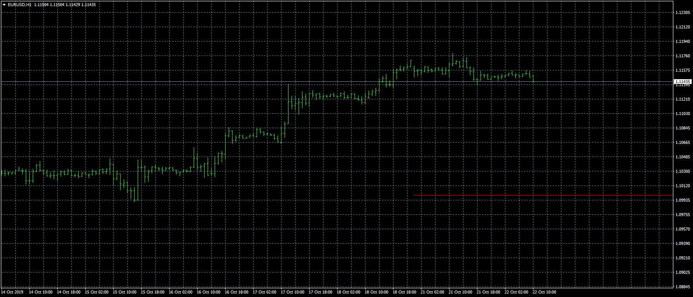

# Horizontal_Lines_with_alerts

> Source: https://fxcodebase.com/code/viewtopic.php?f=38&t=69043  
> Forum: 38 · Topic 69043 · 6 post(s)

---

## Horizontal_Lines_with_alerts

**Apprentice** · Tue Oct 22, 2019 4:38 am

TS2/Lua version.
[viewtopic.php?f=17&t=68793](https://fxcodebase.com/code/viewtopic.php?f=17&t=68793)

 [Horizontal_Lines_with_alerts.mq4](files/129369/Horizontal_Lines_with_alerts.mq4)

---

## Re: Horizontal_Lines_with_alerts

**evansrono** · Mon Sep 28, 2020 5:40 am

Hi,

Please help create multiple lines (8) with the same features, but MTF added to each line to alert on a lower or higher timeframe candle close alert while still viewing in the current timeframe. Thanks.

Regards

---

## Re: Horizontal_Lines_with_alerts

**Apprentice** · Tue Sep 29, 2020 5:29 am

Your request is added to the development list.
Development reference 2125.

---

## Re: Horizontal_Lines_with_alerts

**evansrono** · Wed Oct 14, 2020 6:34 am

Hi,

Thank you for the adjustments. Its better than just having a set number of lines.
On the close of the candle it works, but the alert repeats severally. Could you make it, pop up message and sound alert (with other notification), alert just once. Thanks.

Regards

---

## Re: Horizontal_Lines_with_alerts

**Apprentice** · Thu Oct 15, 2020 1:20 am

Your request is added to the development list.
Development reference 2193.

---

## Re: Horizontal_Lines_with_alerts

**Apprentice** · Mon Oct 19, 2020 5:45 am

[Horizontal_Lines_with_alerts_ver1.mq4](files/138336/Horizontal_Lines_with_alerts_ver1.mq4)

Try this version.
