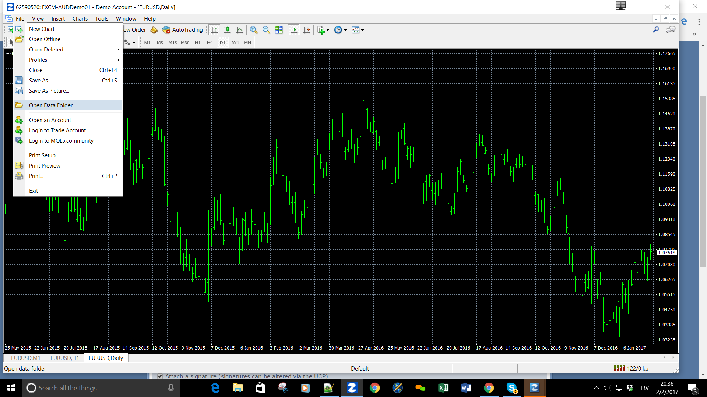
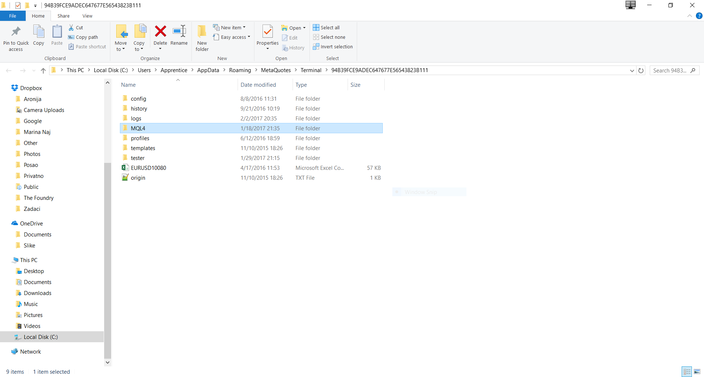
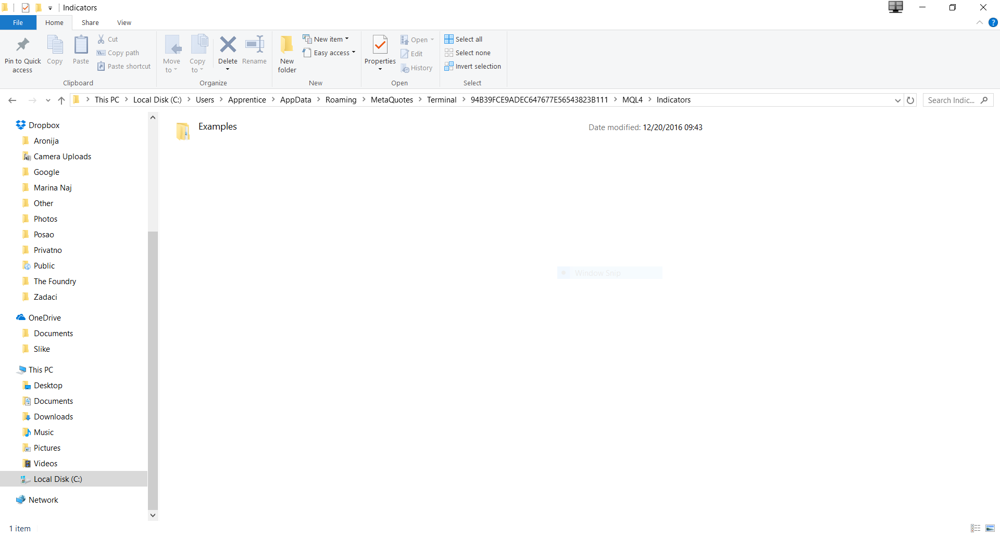

# How to install indicator to MT4 platform

> Source: https://fxcodebase.com/code/viewtopic.php?f=38&t=64381  
> Forum: 38 · Topic 64381 · 5 post(s)

---

## How to install indicator to MT4 platform

**Apprentice** · Thu Feb 02, 2017 3:24 pm

 

 

Restart your TS.

---

## Re: How to install indicator to MT4 platform

**Erebus** · Sun Apr 09, 2017 6:07 am

**Right Click** on the Indicator folder in Navigator window and select**Refresh**

No need to restart MT4 every time

---

## Re: How to install indicator to MT4 platform

**gilda22** · Mon Oct 15, 2018 9:01 am

Hello it's still me Gilles DARCEL

I allow myself to send you a message to know if you have an idea on how to save special criteria on an indicator recognized by MP4

I explain

On MT4 I install the parabolic I want give it a different color and also the size of the points A5 Jje do the necessary everything normally happens to the display of the graph but when I close my platform and the next day I open it again I am still obliged to pass by the steps properties of the indicator then change colors

I would like to know if you know how to modify some indicators and give them my personal touch and especially to reuse them in all models and especially profiles thank you

Unlike the Maketscope TS2 FXCM CAN NOT RECORD THE CHANGES

Greetings

---

## Re: How to install indicator to MT4 platform

**gilda22** · Tue Oct 16, 2018 1:43 am

Hello Apprentice thanks for this answer
This is not what I'm looking for
I know perfectly install an indicator on MT4 I probably have more than 200 (bcp too)

What I can not do is SAVE my criteria of size of color

I take an example
I make appear the indicator TDI with Alerts
I enlarge 2 lines the green and the red to see well the crossings <I put 5 in thickness "
 On my graph I see well appear these curves in size 5 .I record my model TDI Size 5
I close my platform I open it again I load my model TDI Size 5 and missed my TDI appears with usual size 1

It's boring because I have to redo for the 4 graphs on my window opening the change of size and qd I change UT it is also necessary to make these modifications

I search a way the way to record an existing indicator but with different parameters these parameters

I can not record to change these changes on MT4 at AVAtrader

---

## Re: How to install indicator to MT4 platform

**Apprentice** · Thu Oct 18, 2018 6:41 am

One thing I'm not an MT4 advanced user.
Maybe there is a way, a template or something similar.
Send me an indicator via email.
Will change the desired parameters for you.
