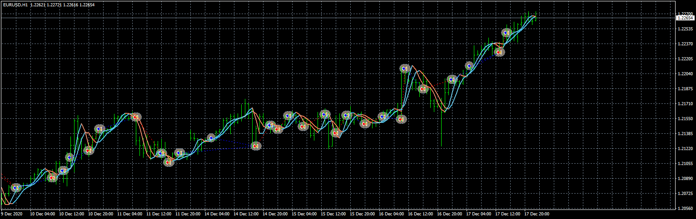

# hull_al_ea

> Source: https://fxcodebase.com/code/viewtopic.php?f=38&t=71185  
> Forum: 38 · Topic 71185 · 7 post(s)

---

## hull_al_ea

**Apprentice** · Tue May 11, 2021 3:46 am

Based on the request.
[https://fxcodebase.com/code/viewtopic.php?f=38&t=71175](https://fxcodebase.com/code/viewtopic.php?f=38&t=71175)

 [hull_al.mq4](files/142004/hull_al.mq4)

 [hull_al_ea.mq4](files/142004/hull_al_ea.mq4)

---

## Re: hull_al_ea

**bruno2017** · Tue May 11, 2021 4:51 am

Hello,
Here is the right indicator with which to make an EA:
purchase if: HULL slow goes up and if HULL fast goes up
exit though: Hull rapid drop.
sell: the opposite thank you and my apologies

---

## Re: hull_al_ea

**Apprentice** · Wed May 12, 2021 5:09 am

Was NOT able to make Double HMA MTF for MT4 Light.ex4 work on my trading station.

---

## Re: hull_al_ea

**bruno2017** · Wed May 12, 2021 5:12 am

Too bad it's a very good indicator
thank you

---

## Re: hull_al_ea

**bruno2017** · Fri May 14, 2021 11:42 am

[HMA Trend.ex4](files/142096/HMA%20Trend.ex4)

Hell

Can you make an EA with this indicator
Purchase: blue arrow with a trailing stop
sell: red arrow has a trailing stop
thank you

---

## Re: hull_al_ea

**Apprentice** · Sat May 15, 2021 7:47 am

Your request is added to the development list.
Development reference 478.

---

## Re: hull_al_ea

**Apprentice** · Mon May 17, 2021 8:35 am

2021.05.17 09:46:04.967 cannot load 'MQL4\indicators\HMA Trend.ex4'
Can you provide the MQ4 version?
