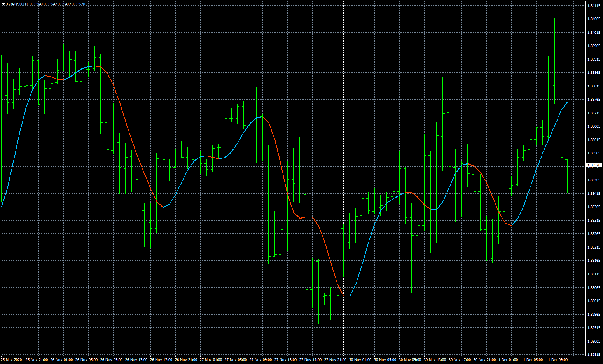

# hull_al_mtf

> Source: https://fxcodebase.com/code/viewtopic.php?f=38&t=70673  
> Forum: 38 · Topic 70673 · 5 post(s)

---

## hull_al_mtf

**Apprentice** · Tue Dec 01, 2020 5:08 am

Based on request.
[viewtopic.php?f=27&t=70654](https://fxcodebase.com/code/viewtopic.php?f=27&t=70654)

 [hull_al.mq4](files/139229/hull_al.mq4)

 [hull_al_mtf.mq4](files/139229/hull_al_mtf.mq4)

 [hull_al.mq5](files/139229/hull_al.mq5)

 [hull_al_mtf.mq5](files/139229/hull_al_mtf.mq5)

---

## Re: hull_al_mtf

**tannos** · Tue Dec 01, 2020 8:36 am

Thank you apprentice to the job.

I have 2 qustions:
1. Is it possible to merge hull_al.mq5 and hull_al_mtf.mq5 into a single file
2. could you make the price choices as a dropdown selection

This is the price list :

Code: [Select all](https://fxcodebase.com/code/)
`enum enPrices
{
   pr_close,      // Close
   pr_open,       // Open
   pr_high,       // High
   pr_low,        // Low
   pr_median,     // Median
   pr_typical,    // Typical
   pr_weighted,   // Weighted
   pr_average,    // Average (high+low+open+close)/4
   pr_medianb,    // Average median body (open+close)/2
   pr_tbiased,    // Trend biased price
   pr_tbiased2,   // Trend biased (extreme) price
   pr_haclose,    // Heiken ashi close
   pr_haopen ,    // Heiken ashi open
   pr_hahigh,     // Heiken ashi high
   pr_halow,      // Heiken ashi low
   pr_hamedian,   // Heiken ashi median
   pr_hatypical,  // Heiken ashi typical
   pr_haweighted, // Heiken ashi weighted
   pr_haaverage,  // Heiken ashi average
   pr_hamedianb,  // Heiken ashi median body
   pr_hatbiased,  // Heiken ashi trend biased price
   pr_hatbiased2, // Heiken ashi trend biased (extreme) price
   pr_habclose,   // Heiken ashi (better formula) close
   pr_habopen ,   // Heiken ashi (better formula) open
   pr_habhigh,    // Heiken ashi (better formula) high
   pr_hablow,     // Heiken ashi (better formula) low
   pr_habmedian,  // Heiken ashi (better formula) median
   pr_habtypical, // Heiken ashi (better formula) typical
   pr_habweighted,// Heiken ashi (better formula) weighted
   pr_habaverage, // Heiken ashi (better formula) average
   pr_habmedianb, // Heiken ashi (better formula) median body
   pr_habtbiased, // Heiken ashi (better formula) trend biased price
   pr_habtbiased2 // Heiken ashi (better formula) trend biased (extreme) price
};

// .....

double getPrice(int tprice, const double& open[], const double& close[], const double& high[], const double& low[], int i, int instanceNo=0)
{
  if (tprice>=pr_haclose)
   {
      if (ArrayRange(workHa,0)!= Bars) ArrayResize(workHa,Bars); instanceNo*=4;
         int r = Bars-i-1;
       
//---
       
         double haOpen;
         if (r>0)
                haOpen  = (workHa[r-1][instanceNo+2] + workHa[r-1][instanceNo+3])/2.0;
         else   haOpen  = (open[i]+close[i])/2;
         double haClose = (open[i] + high[i] + low[i] + close[i]) / 4.0;
         double haHigh  = MathMax(high[i], MathMax(haOpen,haClose));
         double haLow   = MathMin(low[i] , MathMin(haOpen,haClose));

         if(haOpen  <haClose) { workHa[r][instanceNo+0] = haLow;  workHa[r][instanceNo+1] = haHigh; }
         else                 { workHa[r][instanceNo+0] = haHigh; workHa[r][instanceNo+1] = haLow;  }
                                workHa[r][instanceNo+2] = haOpen;
                                workHa[r][instanceNo+3] = haClose;
//---
      switch (tprice)
         {
            case pr_haclose:     return(haClose);
            case pr_haopen:      return(haOpen);
            case pr_hahigh:      return(haHigh);
            case pr_halow:       return(haLow);
            case pr_hamedian:    return((haHigh+haLow)/2.0);
            case pr_hamedianb:   return((haOpen+haClose)/2.0);
            case pr_hatypical:   return((haHigh+haLow+haClose)/3.0);
            case pr_haweighted:  return((haHigh+haLow+haClose+haClose)/4.0);
            case pr_haaverage:   return((haHigh+haLow+haClose+haOpen)/4.0);
            case pr_hatbiased:
               if (haClose>haOpen)
                     return((haHigh+haClose)/2.0);
               else  return((haLow+haClose)/2.0);       
            case pr_hatbiased2:
               if (haClose>haOpen)  return(haHigh);
               if (haClose<haOpen)  return(haLow);
                                    return(haClose);       
         }
   }
//--- 
 
   switch (tprice)
   {
      case pr_close:     return(close[i]);
      case pr_open:      return(open[i]);
      case pr_high:      return(high[i]);
      case pr_low:       return(low[i]);
      case pr_median:    return((high[i]+low[i])/2.0);
      case pr_medianb:   return((open[i]+close[i])/2.0);
      case pr_typical:   return((high[i]+low[i]+close[i])/3.0);
      case pr_weighted:  return((high[i]+low[i]+close[i]+close[i])/4.0);
      case pr_average:   return((high[i]+low[i]+close[i]+open[i])/4.0);
      case pr_tbiased: 
               if (close[i]>open[i])
                     return((high[i]+close[i])/2.0);
               else  return((low[i]+close[i])/2.0);       
      case pr_tbiased2: 
               if (close[i]>open[i]) return(high[i]);
               if (close[i]<open[i]) return(low[i]);
                                     return(close[i]);       
   }
   return(0);
}`

---

## Re: hull_al_mtf

**Apprentice** · Wed Dec 02, 2020 3:22 am

Your request is added to the development list.
Development reference 2387.

---

## Re: hull_al_mtf

**tannos** · Sat Jan 02, 2021 12:54 pm

Hello apprentice.
Are you still working on my request please ?

---

## Re: hull_al_mtf

**Apprentice** · Sun Jan 03, 2021 5:39 am

It's possible but it'll take much more time for development.
Two separate files is a faster option.
The price choice already using a dropdown.
