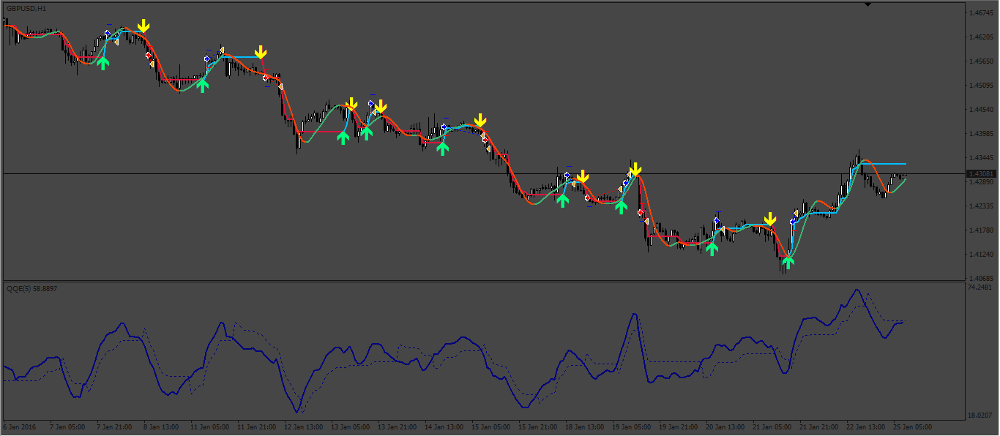

# Hull_FLI_QQE_EA

> Source: https://fxcodebase.com/code/viewtopic.php?f=38&t=73199  
> Forum: 38 · Topic 73199 · 3 post(s)

---

## Hull_FLI_QQE_EA

**Apprentice** · Sat Jan 14, 2023 3:42 am

Based on the request.
[https://fxcodebase.com/code/viewtopic.php?f=38&t=73100](https://fxcodebase.com/code/viewtopic.php?f=38&t=73100)

 [FLI_indicator.mq4](files/149084/FLI_indicator.mq4)

 [Hull.mq4](files/149084/Hull.mq4)

 [QQE.mq4](files/149084/QQE.mq4)

 [Hull_FLI_QQE_EA.mq4](files/149084/Hull_FLI_QQE_EA.mq4)

---

## Re: Hull_FLI_QQE_EA

**mozart13** · Sat Jan 14, 2023 5:01 pm

in testing looks like very good ea, gonna run it on demo, 30 min, if it's good will post set file.
thx!

---

## Re: Hull_FLI_QQE_EA

**Wasim393** · Tue Jan 24, 2023 6:30 am

> **mozart13 wrote:**
> in testing looks like very good ea, gonna run it on demo, 30 min, if it's good will post set file.
> thx!

 Many Tnx for your effort,waiting for Set file
