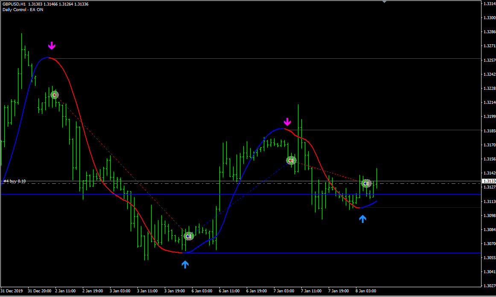

# hull-moving-average-arrows EA

> Source: https://fxcodebase.com/code/viewtopic.php?f=38&t=71747  
> Forum: 38 · Topic 71747 · 5 post(s)

---

## hull-moving-average-arrows EA

**Apprentice** · Thu Dec 30, 2021 6:17 am

Based on the request.
[https://fxcodebase.com/code/viewtopic.p ... 26#p144526](https://fxcodebase.com/code/viewtopic.php?f=27&p=144526#p144526)

 [hull-moving-average-arrows.mq4](files/144574/hull-moving-average-arrows.mq4)

 [hull-moving-average-arrows EA.mq4](files/144574/hull-moving-average-arrows%20EA.mq4)

---

## Re: hull-moving-average-arrows EA

**Elioak** · Wed Jan 12, 2022 3:43 pm

Can you please add break-even and TSL functions to this EA?

---

## Re: hull-moving-average-arrows EA

**Apprentice** · Fri Jan 14, 2022 7:07 am

Your request is added to the development list.
Development reference 33.

---

## Re: hull-moving-average-arrows EA

**Apprentice** · Mon Jan 24, 2022 6:34 am

[hull-moving-average-arrows.mq4](files/144821/hull-moving-average-arrows.mq4)

 [hull-moving-average-arrows_EA.mq4](files/144821/hull-moving-average-arrows_EA.mq4)

Try this version.

---

## Re: hull-moving-average-arrows EA

**papaprabu** · Fri Feb 11, 2022 10:48 pm

please also add
multiply lot when loss
