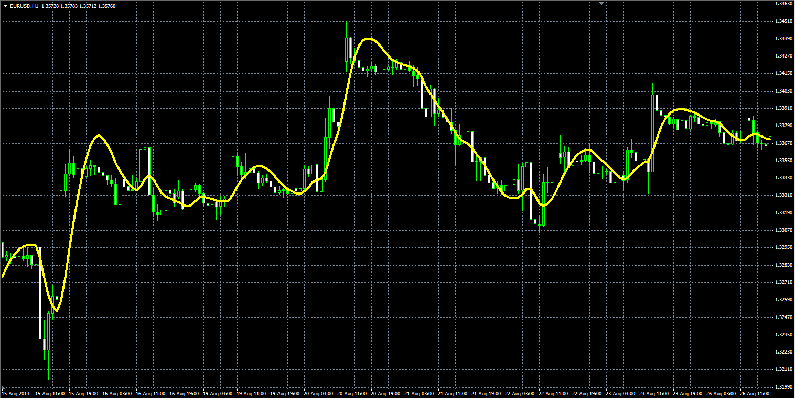

# Hull Moving Average

> Source: https://fxcodebase.com/code/viewtopic.php?f=38&t=59630  
> Forum: 38 · Topic 59630 · 1 post(s)

---

## Hull Moving Average

**Alexander.Gettinger** · Wed Oct 09, 2013 10:10 am

Hull Moving Average by Alan Hull (HMA).

Formulas:
HMA[i] = LWMA(i,len,(2*LWMA(i,Length/2,Price)-LWMA(i,Length,Price))), where
len=Sqrt(Length)-1,
LWMA(i,N,Price) - Linear Weighted Moving Average.

 

Download:

 [HMA.mq4](files/89912/HMA.mq4)
