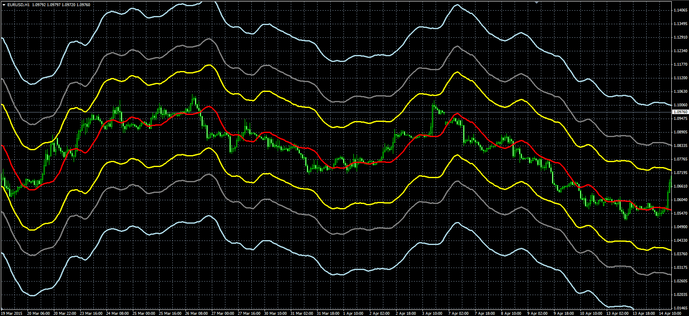
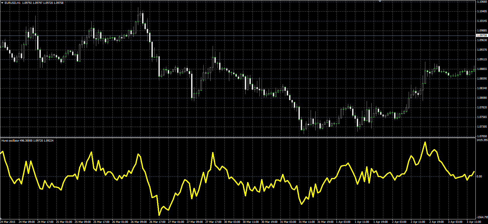

# Hurst Bands

> Source: https://fxcodebase.com/code/viewtopic.php?f=38&t=62170  
> Forum: 38 · Topic 62170 · 1 post(s)

---

## Hurst Bands

**Alexander.Gettinger** · Thu Apr 30, 2015 10:14 am

Original LUA indicators: [viewtopic.php?f=17&t=61075](https://fxcodebase.com/code/viewtopic.php?f=17&t=61075).

Formulas:
Center[i] = MA[i-Length/2-1],
UExtreme[i] = Center[i]*(1+Extreme_Value/100),
LExtreme[i] = Center[i]*(1-Extreme_Value/100),
UOuter[i] = Center[i]*(1+Outer_Value/100),
LOuter[i] = Center[i]*(1-Outer_Value/100),
UInner[i] = Center[i]*(1+Inner_Value/100),
LInner[i] = Center[i]*(1-Inner_Value/100), where
MA = MVA(Median price) with [Length] number of periods.

 

Download:

 [Hurst_Bands.mq4](files/100176/Hurst_Bands.mq4)

**Hurst Oscillator:**

Formula:
HO[i] = MA[i]-CMA[i-Length/2-1], where
CMA = MVA(Median price) with [Length] number of periods,
MA = MVA(FlowValue) with [Smooth] number of periods,
FlowValue[i] = High[i], if Close[i]>Close[i-1],
FlowValue[i] = Low[i], if Close[i]<Close[i-1],
FlowValue[i] = (High[i]+Low[i])/2, if Close[i]=Close[i-1].

 

Download:

 [Hurst_Oscillator.mq4](files/100176/Hurst_Oscillator.mq4)
