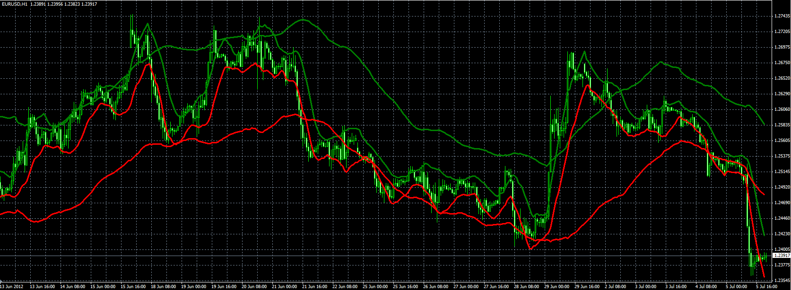

# Hurst Channel Indicator

> Source: https://fxcodebase.com/code/viewtopic.php?f=38&t=20880  
> Forum: 38 · Topic 20880 · 7 post(s)

---

## Hurst Channel Indicator

**Alexander.Gettinger** · Thu Jul 05, 2012 5:14 pm

The indicator is written in accordance with the request: [viewtopic.php?f=27&t=20589&p=36030#p36030](https://fxcodebase.com/code/viewtopic.php?f=27&t=20589&p=36030#p36030)

 

Download:

 [Hurst_Channel.mq4](files/36569/Hurst_Channel.mq4)

---

## Re: Hurst Channel Indicator

**philname** · Thu Sep 06, 2012 7:56 am

Hello good indicator.

But the last candlestick is not show.

Can somebody modify this indicator to show this ??

---

## Re: Hurst Channel Indicator

**Alexander.Gettinger** · Thu Sep 06, 2012 4:09 pm

Indicator with last tick:

 [Hurst_Channel2.mq4](files/39800/Hurst_Channel2.mq4)

---

## Re: Hurst Channel Indicator

**philname** · Thu Sep 06, 2012 7:27 pm

great thanks !!!!!!!!!!!

it work very fine !

---

## Re: Hurst Channel Indicator

**Coondawg71** · Wed Feb 05, 2014 8:23 am

Two requests for the same indicator:
[viewtopic.php?f=27&t=20589&p=92600#p92600](https://fxcodebase.com/code/viewtopic.php?f=27&t=20589&p=92600#p92600)
1.)Can we please request Alert functions to this great indicator.

a. Price close above/below median line on both short and long cycles
b. Price close above/below high or low deviation value on both short and long cycles.
c. CROSS of short cycle median value above/below long median value.

2.) Can we please request cloud coloration for upper channel/lower channel.

This would be great addition to this indicator.

Thanks!!!

sjc

---

## Re: Hurst Channel Indicator

**Apprentice** · Thu Feb 06, 2014 2:27 am

Your request is added to the development list.

---

## Re: Hurst Channel Indicator

**Alexander.Gettinger** · Sat Mar 10, 2018 3:53 pm

Hurst channel with alerts:

 [Hurst_Channel_With_Alert.mq4](files/118119/Hurst_Channel_With_Alert.mq4)
