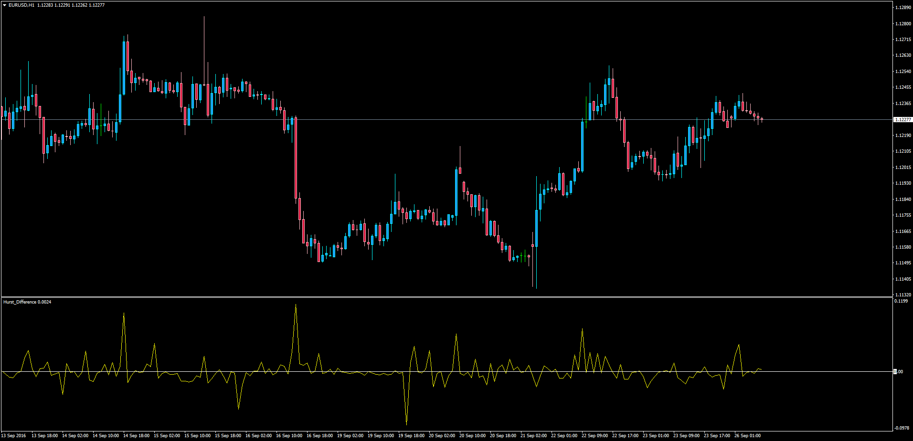

# Hurst Difference

> Source: https://fxcodebase.com/code/viewtopic.php?f=38&t=63898  
> Forum: 38 · Topic 63898 · 3 post(s)

---

## Hurst Difference

**Apprentice** · Mon Sep 26, 2016 4:12 am

LUA Original: [viewtopic.php?f=17&t=1258](https://fxcodebase.com/code/viewtopic.php?f=17&t=1258)

Description:

MT4 adaptation to the Hurst Difference Oscillator found in [viewtopic.php?f=17&t=1258](https://fxcodebase.com/code/viewtopic.php?f=17&t=1258) - This indicator is based on the assumption that the price variations follow a multi-fractal model. From there, the Hurst exponent can be easily computed from the fractal dimension. The variations of this Hurst exponent can actually be seen as predicting the variations of the volatility, and they therefore provide a time for entering into a trade (whenever this variation is positive), in order to profit from the high volatility period.

To use this tool it is required to use a directional indicator.

 [Hurst_Difference.mq4](files/108263/Hurst_Difference.mq4)

---

## Re: Hurst Difference

**amvt85** · Mon Nov 13, 2017 9:55 am

Hello,

Every time I try to edit the zero line to a different number it always revert back? Why is that?

Thanks!

---

## Re: Hurst Difference

**Apprentice** · Sun Nov 19, 2017 4:30 pm

You have to edit line 38
SetLevelValue(0,0);
