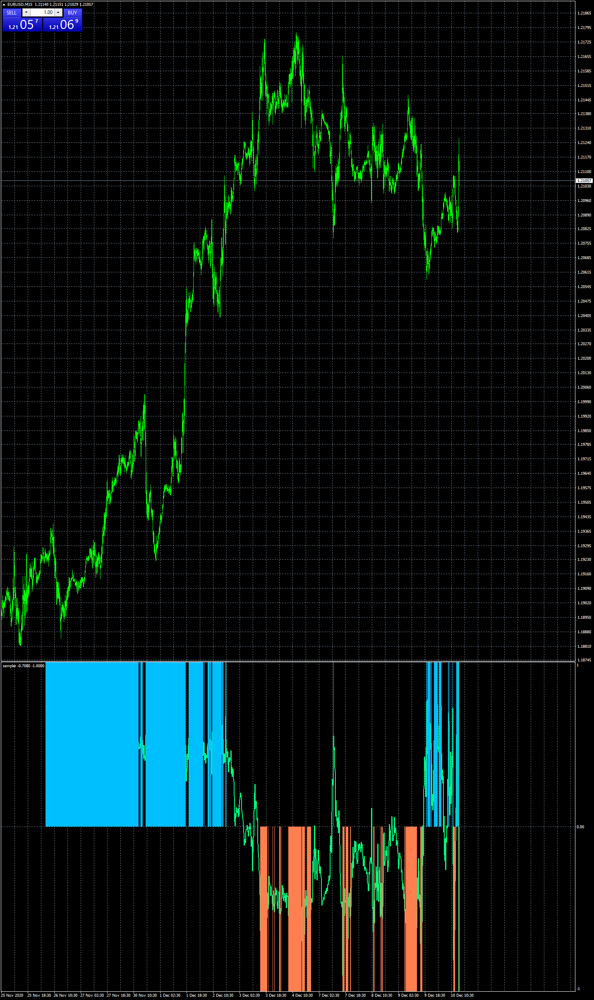

# i_sampler

> Source: https://fxcodebase.com/code/viewtopic.php?f=38&t=70707  
> Forum: 38 · Topic 70707 · 14 post(s)

---

## i_sampler

**Apprentice** · Thu Dec 10, 2020 8:26 am

Based on request.
[viewtopic.php?f=27&t=70693](https://fxcodebase.com/code/viewtopic.php?f=27&t=70693)

 [i_sampler.mq4](files/139449/i_sampler.mq4)

---

## Re: i_sampler

**planstyr** · Thu Dec 10, 2020 9:39 am

Apprentice thanks a lot.
But arrows not visible?

---

## Re: i_sampler

**Apprentice** · Fri Dec 11, 2020 4:04 am

Your request is added to the development list.
Development reference 2442.

---

## Re: i_sampler

**Apprentice** · Sat Dec 12, 2020 7:34 am

Try this version.

---

## Re: i_sampler

**planstyr** · Sat Dec 12, 2020 8:41 am

which version?

---

## Re: i_sampler

**Apprentice** · Sun Dec 13, 2020 2:00 pm

The file was updated.

---

## Re: i_sampler

**planstyr** · Sun Dec 13, 2020 9:30 pm

**Apprentice** thanks for your effort. But can you a bit modify it?
Cuz in the latest version, arrows are on every candle. But I want the arrows to appear only on blue and red bars like in the screen I have attached. And please make the code of arrows 233 and 234.

---

## Re: i_sampler

**Apprentice** · Mon Dec 14, 2020 6:45 am

Your request is added to the development list.
Development reference 2460.

---

## Re: i_sampler

**Apprentice** · Tue Dec 15, 2020 12:16 pm

[i_sampler.mq4](files/139588/i_sampler.mq4)

Try this version.

---

## Re: i_sampler

**planstyr** · Wed Dec 16, 2020 2:42 am

Great, thank you very much!!!

---

## Re: i_sampler

**planstyr** · Wed Dec 16, 2020 2:47 am

Sorry **Apprentice**.
Another request. Can you please delete the bottom chart?
And just leave the arrows on the main chart.

---

## Re: i_sampler

**Apprentice** · Wed Dec 16, 2020 9:31 am

Your request is added to the development list.
Development reference 2482.

---

## Re: i_sampler

**Apprentice** · Fri Dec 18, 2020 6:34 am

[i_sampler.mq4](files/139670/i_sampler.mq4)

Try this version.

---

## Re: i_sampler

**planstyr** · Fri Dec 18, 2020 7:45 am

Wow! That's what I wanted. Thank you very much!
