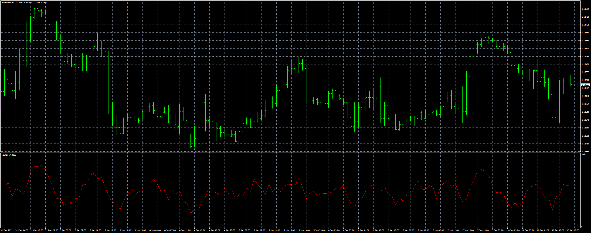

# IBS_EA

> Source: https://fxcodebase.com/code/viewtopic.php?f=38&t=71988  
> Forum: 38 · Topic 71988 · 13 post(s)

---

## IBS_EA

**Apprentice** · Tue Mar 22, 2022 3:06 am

Based on the request.
[https://fxcodebase.com/code/viewtopic.php?f=38&t=71921](https://fxcodebase.com/code/viewtopic.php?f=38&t=71921)

 [IBS.mq4](files/145400/IBS.mq4)

 [IBS_EA.mq4](files/145400/IBS_EA.mq4)

 [IBS.mq5](files/145400/IBS.mq5)

 [IBS_EA.mq5](files/145400/IBS_EA.mq5)

---

## Re: IBS_EA

**rafiqmt4** · Fri May 27, 2022 6:35 am

Dear Apprentice,

Please convert the IBS_EA to MQ5

Thanks

---

## Re: IBS_EA

**Apprentice** · Fri May 27, 2022 11:46 am

We have added your request to the development list.
Development reference 316.

---

## Re: IBS_EA

**makomajor** · Sun Jul 31, 2022 1:36 pm

Hello Dear Coders,

Could you please add Time Filter to the EA.
Please add more, 3 time filters./ for example
form 06.00-08.30, second form 09.00- 17.30, third from 18.00- 22.00 / Thank you.

Regards

Makomajor

---

## Re: IBS_EA

**makomajor** · Mon Aug 01, 2022 4:15 am

Hello Dear Coders,

Please add Time filter, it would be far enough to have 2 time filter / for example from 09.00-17.30 and from 18.00 - 22.00 /. Thank you.

Regards

Makomajor

---

## Re: IBS_EA

**Apprentice** · Tue Aug 02, 2022 4:45 am

We have added your request to the development list.
Development reference 454.

---

## Re: IBS_EA

**Apprentice** · Fri Aug 12, 2022 2:47 pm

[IBS_EA_v2.mq4](files/147058/IBS_EA_v2.mq4)

Try this version.

---

## Re: IBS_EA

**forexak7** · Fri Nov 11, 2022 9:41 am

Dear Coders,

 Please add to the Time Filter also possibility of Mandatory Close during Time Filter.
/ so will close the trade when the time is ready in the time filter /. Thank you.

Regards

---

## Re: IBS_EA

**Apprentice** · Sun Nov 13, 2022 3:37 am

We have added your request to the development list.
Development reference 730.

---

## Re: IBS_EA

**forexak7** · Wed Nov 16, 2022 9:14 am

Dear Coders,

 Could you please switch off the possibility to open treades in the trending market, when the indicator is above/below certain level. When I switch on Mt4 platform, it opens trade automaticaly.
EA takes the trade after the candle close also outside the level, this cause significant losses.
It is better to wait only on crossing certain level, and not take other trades. Thank you in advance..

Best regards

---

## Re: IBS_EA

**Apprentice** · Thu Nov 17, 2022 4:37 am

We have added your request to the development list.
Development reference 764.

---

## Re: IBS_EA

**Apprentice** · Tue Nov 29, 2022 8:27 am

MT5 version added.

---

## Re: IBS_EA

**Apprentice** · Thu Oct 02, 2025 4:49 am

Task 730

 [IBS_EA_v2.mq4](files/160720/IBS_EA_v2.mq4)
