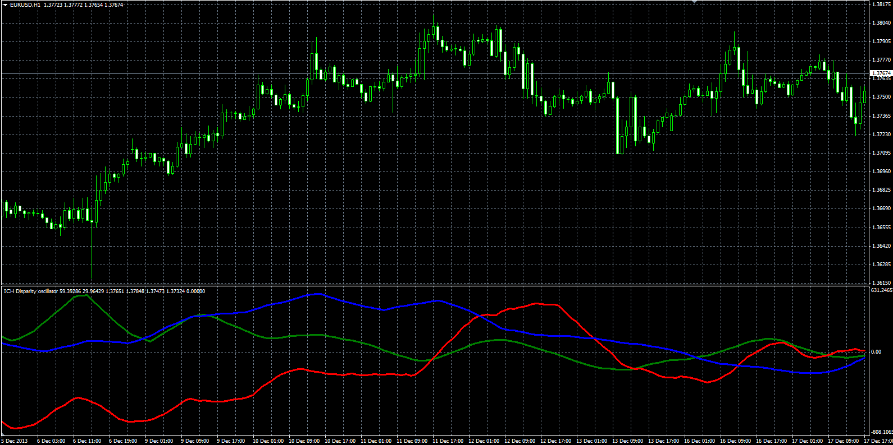

# ICH Disparity

> Source: https://fxcodebase.com/code/viewtopic.php?f=38&t=60404  
> Forum: 38 · Topic 60404 · 5 post(s)

---

## ICH Disparity

**Alexander.Gettinger** · Wed Mar 05, 2014 5:03 pm

Original LUA oscillator: [viewtopic.php?f=17&t=60206](https://fxcodebase.com/code/viewtopic.php?f=17&t=60206).

 

Download:

 [Ich_Disparity.mq4](files/93041/Ich_Disparity.mq4)

---

## Re: ICH Disparity

**durlovjagiroad** · Sat Jun 22, 2019 9:41 am

can you please add crossover alert

---

## Re: ICH Disparity

**tucuxi** · Mon Jun 24, 2019 8:44 am

> **Alexander.Gettinger wrote:**
> Original LUA oscillator: [viewtopic.php?f=17&t=60206](https://fxcodebase.com/code/viewtopic.php?f=17&t=60206).
>
>
>
> The attachment **Ich_Disparity_MQL.PNG** is no longer available
>
>
>
> Download:
>
>
> The attachment **Ich_Disparity_MQL.PNG** is no longer available

Hello,

Maybe is a stupid question but, is possible do a NRP "future" price for the Red Line ? Future means be plotted at current bar. (image attached)

Thanks in advance.

Best Regards,
Tucuxi

---

## Re: ICH Disparity

**Apprentice** · Mon Jun 24, 2019 12:13 pm

ICH Chinkou line is calculated/shifted this way.
You can try to change indicator parameters.

---

## Re: ICH Disparity

**tucuxi** · Mon Jun 24, 2019 12:34 pm

> **Apprentice wrote:**
> ICH Chinkou line is calculated/shifted this way.
> You can try to change indicator parameters.

Hi Apprentice,

I understand that Chinkou line is calculated/shifted this way, but if it was possible with the same original parameters we can have the future values plotted it was perfect for defining the extremes of the market.

Regards,
Tucuxi
