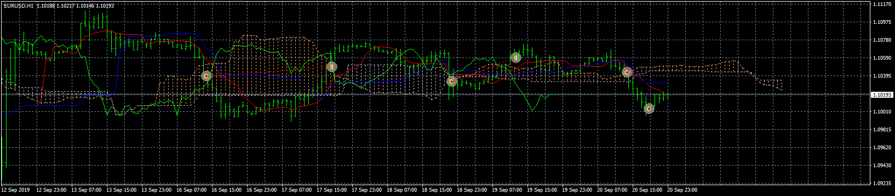
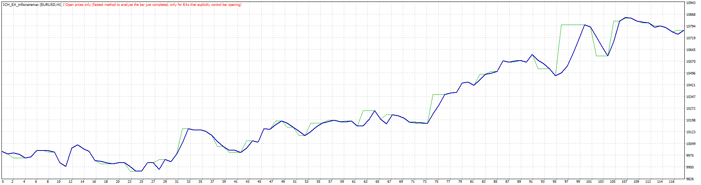

# ICH_EA_trillionairemac

> Source: https://fxcodebase.com/code/viewtopic.php?f=38&t=69074  
> Forum: 38 · Topic 69074 · 26 post(s)

---

## ICH_EA_trillionairemac

**Apprentice** · Thu Oct 31, 2019 6:31 am

 

Based on request.
[viewtopic.php?f=38&t=68827](https://fxcodebase.com/code/viewtopic.php?f=38&t=68827)

BUY-
1: Price closes above SENKOU SPAN B
2: TENKAN breaks above KIJUN
3: CHIKOU breaks above SENKOU SPAN B
4: Place protective stop loss below the Candle that broke out above the cloud
5: Take Profit when the TEKAN crosses below the KIJUN.

SELL-
1: Price closes below SENKOU SPAN A
2: TENKAN breaks below KIJUN
3. CHIKOU breaks below SENKOU SPAN B
4. Place Protective SL above the candle that broke below the cloud.
5: Take profit when the TEKAN crosses above theKIJUN.

 [ICH_EA_trillionairemac.mq4](files/129507/ICH_EA_trillionairemac.mq4)

 [ICH_EA_trillionairemac.mq5](files/129507/ICH_EA_trillionairemac.mq5)

TS2/Lua version.
[viewtopic.php?f=31&t=69225](https://fxcodebase.com/code/viewtopic.php?f=31&t=69225)

---

## Re: ICH_EA_trillionairemac

**trillionairemac** · Wed Nov 06, 2019 7:01 pm

YES! THIS IS AMAZING. Thank you!

Can you message me? I have a few questions on the settings.

---

## Re: ICH_EA_trillionairemac

**trillionairemac** · Wed Nov 06, 2019 10:45 pm

For some reason EA only takes sells, Help?

---

## Re: ICH_EA_trillionairemac

**Apprentice** · Thu Nov 07, 2019 8:43 am

Your request is added to the development list.
Development reference 290.

---

## Re: ICH_EA_trillionairemac

**Apprentice** · Fri Nov 08, 2019 5:01 am

Try it now.

---

## Re: ICH_EA_trillionairemac

**planstyr** · Fri Nov 08, 2019 5:17 am

> **Apprentice wrote:**
> Try it now.

where is it?

---

## Re: ICH_EA_trillionairemac

**Apprentice** · Fri Nov 08, 2019 8:35 am

First,Top post of the topic was updated.

---

## Re: ICH_EA_trillionairemac

**trillionairemac** · Fri Nov 08, 2019 5:11 pm

> **Apprentice wrote:**
> Try it now.

When I try to edit the take profit values in pips and the trailing stop loss in pips, it does not change in the strategy tester. Can you fix this?

---

## Re: ICH_EA_trillionairemac

**trillionairemac** · Fri Nov 08, 2019 5:38 pm

> **Apprentice wrote:**
> Try it now.

Can you set it to have a Take profit of 50 pips and a stoploss of 50 pips?

If so, am I doing it correctly?

---

## Re: ICH_EA_trillionairemac

**Richstocks99** · Fri Nov 08, 2019 6:06 pm

Hello, Could you add an 200 ema as an add on.

if price crosses above ema
its a buy only if the ichi strategy shows a buy signal

if price crosses below ema
its a sell only if the ichi strategy shows a sell signal

If this makes sense

---

## Re: ICH_EA_trillionairemac

**guenoob** · Sat Nov 09, 2019 5:50 am

hi, i'm new in this forum, can you help me set the parameter? or maybe you can share your parameter setting. thanks

---

## Re: ICH_EA_trillionairemac

**Camulus** · Mon Nov 18, 2019 7:15 am

Hi everyone,
I'm new to this forum and some of my EA just don't activate (including this one). I slide it but nothing's happening. Anyone encountered this issue before ?

---

## Re: ICH_EA_trillionairemac

**ajc922** · Tue Nov 19, 2019 4:49 pm

I'm having trouble with testing. I've tried tweaking the inputs to figure out what is going on but I'm only getting 4 trades maximum. Even though I have the testing time frame set to 3 months it always stops trading after like 7 days on virtual mode. Any suggestions? Could you screenshot suggested parameters for testing?

---

## Re: ICH_EA_trillionairemac

**yolerap** · Sun Dec 08, 2019 11:08 am

Hi,

Possible to translate this strategy into LUA language ?
Thanks,

---

## Re: ICH_EA_trillionairemac

**Apprentice** · Tue Dec 10, 2019 6:47 am

Your request is added to the development list.
Development reference 415.

---

## Re: ICH_EA_trillionairemac

**Apprentice** · Wed Dec 11, 2019 5:36 pm

TS2/Lua version.
[viewtopic.php?f=31&t=69225](https://fxcodebase.com/code/viewtopic.php?f=31&t=69225)

---

## Re: ICH_EA_trillionairemac

**softkill21** · Fri May 29, 2020 6:19 am

Hello Apprentice.

First I would like to thank you for the awesome job you always do.Much appreciated.

I wanted to ask you about a problem I was noticing when I am trying to optimize the EA, inside mt4.

It doesnt matter what currency I choose or what time frame, I get this error inside journal over and over again but with different vallues, but its always invalid pointer in 1478,7.

2020.05.29 11:24:05.552	ICH_EA_trillionairemac: critical error on the pass 1640393100
2020.05.29 11:24:05.552	ICH_EA_trillionairemac USDCHF,H1: invalid pointer access in 'ICH_EA_trillionairemac.mq4' (1478,7)

I noticed that even so, its still does it job and do the optimize, but can you please tell me if its affecting the results somehow ?

---

## Re: ICH_EA_trillionairemac

**softkill21** · Fri May 29, 2020 3:55 pm

Bro first of all thanks for the awesome job.

I wanted to ask you about some sort of message errors I am receiving when I am backtesting and forward testing this EA.

For example when I backtest, I receive this error which is repeating over and over again with all the currencies I tried.
2020.05.29 19:50:19.626	ICH_EA_trillionairemac: critical error on the pass 24349188162020296
2020.05.29 19:50:19.626	ICH_EA_trillionairemac NZDCHF,M30: invalid pointer access in 'ICH_EA_trillionairemac.mq4' (1479,7)
2020.05.29 19:50:19.433	ICH_EA_trillionairemac: critical error on the pass 24231048162020296
2020.05.29 19:50:19.433	ICH_EA_trillionairemac NZDCHF,M30: invalid pointer access in 'ICH_EA_trillionairemac.mq4' (1479,7)

The next one I receive when I am forward testing, in live:
2020.05.29 19:50:19.626	ICH_EA_trillionairemac: critical error on the pass 24349188162020296
2020.05.29 19:50:19.626	ICH_EA_trillionairemac NZDCHF,M30: invalid pointer access in 'ICH_EA_trillionairemac.mq4' (1479,7)
2020.05.29 19:50:19.433	ICH_EA_trillionairemac: critical error on the pass 24231048162020296
2020.05.29 19:50:19.433	ICH_EA_trillionairemac NZDCHF,M30: invalid pointer access in 'ICH_EA_trillionairemac.mq4' (1479,7)

What do you think about it bro?

---

## Re: ICH_EA_trillionairemac

**Apprentice** · Sun May 31, 2020 4:10 am

Your request is added to the development list.
Development reference 1400.

---

## Re: ICH_EA_trillionairemac

**Apprentice** · Thu Jun 11, 2020 6:12 am

Fixed.

---

## Re: ICH_EA_trillionairemac

**forextraderaz** · Mon Jul 06, 2020 4:51 pm

> **Apprentice wrote:**
>
>
> eurusd-h1-forex-capital-markets.png
>
>
>
>
> TesterGraph.gif
>
>
> Based on request.
> [viewtopic.php?f=38&t=68827](https://fxcodebase.com/code/viewtopic.php?f=38&t=68827)
>
>
> BUY-
> 1: Price closes above SENKOU SPAN B
> 2: TENKAN breaks above KIJUN
> 3: CHIKOU breaks above SENKOU SPAN B
> 4: Place protective stop loss below the Candle that broke out above the cloud
> 5: Take Profit when the TEKAN crosses below the KIJUN.
>
> SELL-
> 1: Price closes below SENKOU SPAN A
> 2: TENKAN breaks below KIJUN
> 3. CHIKOU breaks below SENKOU SPAN B
> 4. Place Protective SL above the candle that broke below the cloud.
> 5: Take profit when the TEKAN crosses above theKIJUN.
>
>
>
> ICH_EA_trillionairemac.mq4
>
>
>
> TS2/Lua version.
> [viewtopic.php?f=31&t=69225](https://fxcodebase.com/code/viewtopic.php?f=31&t=69225)

Do you have MT5 version of this EA?

---

## Re: ICH_EA_trillionairemac

**Apprentice** · Tue Jul 07, 2020 7:58 am

Your request is added to the development list.
Development reference 1644.

---

## Re: ICH_EA_trillionairemac

**Apprentice** · Wed Jul 08, 2020 5:05 am

ICH_EA_trillionairemac.mq5 added.

---

## Re: ICH_EA_trillionairemac

**ElectricSavant** · Wed Oct 21, 2020 3:33 pm

I cannot have an EA like this. If you turn off your platform and reboot...it places another trade.

ES

---

## Re: ICH_EA_trillionairemac

**konz03674** · Sat Apr 09, 2022 7:55 am

Hello!
Could you add Martingale mode for MT5 version?
Tank you.

> **Apprentice wrote:**
>
>
> eurusd-h1-forex-capital-markets.png
>
>
>
>
> TesterGraph.gif
>
>
> Based on request.
> [viewtopic.php?f=38&t=68827](https://fxcodebase.com/code/viewtopic.php?f=38&t=68827)
>
>
> BUY-
> 1: Price closes above SENKOU SPAN B
> 2: TENKAN breaks above KIJUN
> 3: CHIKOU breaks above SENKOU SPAN B
> 4: Place protective stop loss below the Candle that broke out above the cloud
> 5: Take Profit when the TEKAN crosses below the KIJUN.
>
> SELL-
> 1: Price closes below SENKOU SPAN A
> 2: TENKAN breaks below KIJUN
> 3. CHIKOU breaks below SENKOU SPAN B
> 4. Place Protective SL above the candle that broke below the cloud.
> 5: Take profit when the TEKAN crosses above theKIJUN.
>
>
>
> ICH_EA_trillionairemac.mq4
>
>
>
>
> ICH_EA_trillionairemac.mq5
>
>
>
> TS2/Lua version.
> [viewtopic.php?f=31&t=69225](https://fxcodebase.com/code/viewtopic.php?f=31&t=69225)

---

## Re: ICH_EA_trillionairemac

**Apprentice** · Sat Apr 09, 2022 12:13 pm

Your request is added to the development list.
Development reference 221.
