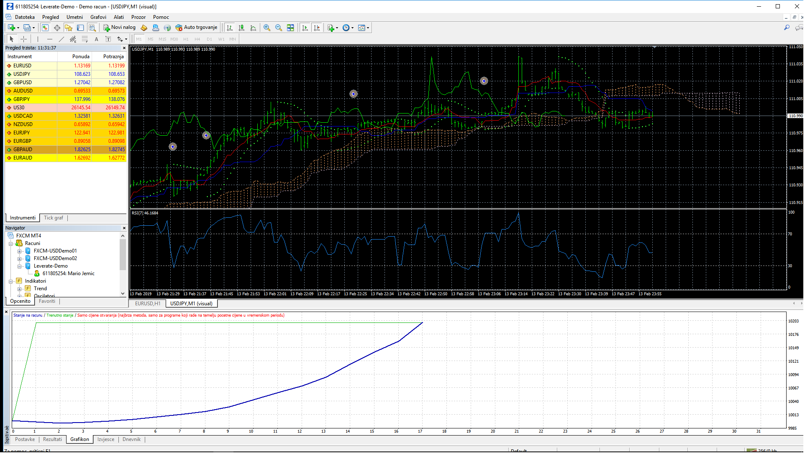

# ICH_RSI_PSAR

> Source: https://fxcodebase.com/code/viewtopic.php?f=38&t=68557  
> Forum: 38 · Topic 68557 · 5 post(s)

---

## ICH_RSI_PSAR

**Apprentice** · Tue Jun 11, 2019 5:27 am

Based on request.
[viewtopic.php?f=27&t=68546](https://fxcodebase.com/code/viewtopic.php?f=27&t=68546)

 [ICH_RSI_PSAR.mq4](files/126829/ICH_RSI_PSAR.mq4)

---

## Re: ICH_RSI_PSAR

**JaxPacific** · Wed Jun 19, 2019 1:14 am

Whoa! That is an attractive curve. Do you have a .set file for that for testing?

---

## Re: ICH_RSI_PSAR

**Apprentice** · Wed Jun 19, 2019 4:35 am

Default settings are used.

---

## Re: ICH_RSI_PSAR

**Yoshi822** · Wed Jun 19, 2019 11:39 am

I thank you for this EA ! Did you put SL and TP for this test ? Because I don't have this curve.

---

## Re: ICH_RSI_PSAR

**JaxPacific** · Wed Jun 19, 2019 10:47 pm

That was my question too. Default settings didn't work like that for me. The equity curve went down.
