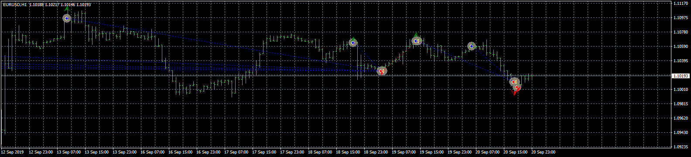
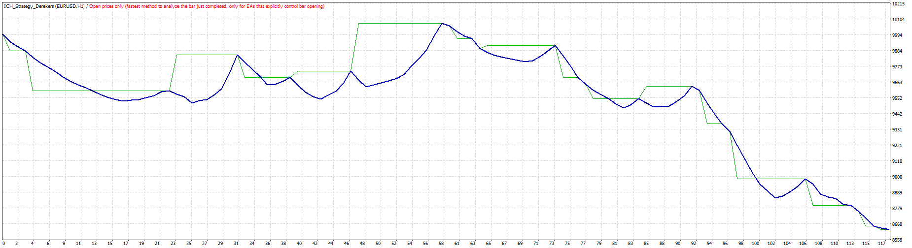
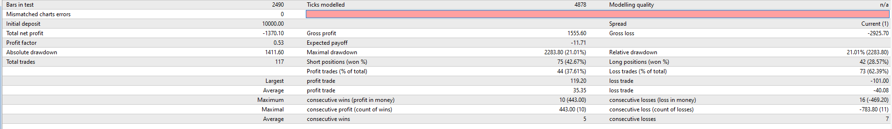

# ICH_Strategy_Derekers

> Source: https://fxcodebase.com/code/viewtopic.php?f=38&t=68945  
> Forum: 38 · Topic 68945 · 4 post(s)

---

## ICH_Strategy_Derekers

**Apprentice** · Mon Sep 23, 2019 6:51 am

 

 

Based on request.
[viewtopic.php?f=27&t=68301](https://fxcodebase.com/code/viewtopic.php?f=27&t=68301)

 [ICH With Alert Derekers.mq4](files/128839/ICH%20With%20Alert%20Derekers.mq4)

 [ICH_Strategy_Derekers.mq4](files/128839/ICH_Strategy_Derekers.mq4)

 [ICH_With_Alert_Derekers.mq5](files/128839/ICH_With_Alert_Derekers.mq5)

 [ICH_With_Alert_Derekers_EA.mq5](files/128839/ICH_With_Alert_Derekers_EA.mq5)

---

## Re: ICH_Strategy_Derekers

**quintana** · Fri Sep 09, 2022 2:22 pm

possible mql5 version ?
expert and indi ?
thanks
good on flat market or range price

---

## Re: ICH_Strategy_Derekers

**Apprentice** · Sat Sep 10, 2022 4:05 am

We have added your request to the development list.
Development reference 549.

---

## Re: ICH_Strategy_Derekers

**Apprentice** · Tue Nov 29, 2022 8:07 am

MT5 version added.
