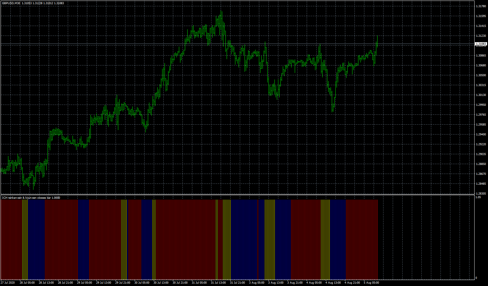

# ICH tenkan-sen & kijun-sen crosses bar

> Source: https://fxcodebase.com/code/viewtopic.php?f=38&t=70802  
> Forum: 38 · Topic 70802 · 4 post(s)

---

## ICH tenkan-sen & kijun-sen crosses bar

**Apprentice** · Sun Jan 10, 2021 2:42 am

Based on request.
[viewtopic.php?f=27&t=70784](https://fxcodebase.com/code/viewtopic.php?f=27&t=70784)

 [ICH tenkan-sen & kijun-sen crosses bar.mq4](files/140119/ICH%20tenkan-sen%20kijun-sen%20crosses%20bar.mq4)

 [ICH_tenkan-sen_&_kijun-sen_crosses_bar_with_alert.mq4](files/140119/ICH_tenkan-sen__kijun-sen_crosses_bar_with_alert.mq4)

---

## Re: ICH tenkan-sen & kijun-sen crosses bar

**Adria77** · Sun May 08, 2022 3:29 am

Could you please add alerts (sound, pop up, email, push) at candle close when trend/colour changes included neutral trend (blue, red and yellow).
Thanks in advance.

---

## Re: ICH tenkan-sen & kijun-sen crosses bar

**Apprentice** · Tue May 10, 2022 6:35 am

We have added your request to the development list.
Development reference 286.

---

## Re: ICH tenkan-sen & kijun-sen crosses bar

**Apprentice** · Mon May 30, 2022 11:45 am

ICH_tenkan-sen_&_kijun-sen_crosses_bar_with_alert.mq4 added.
