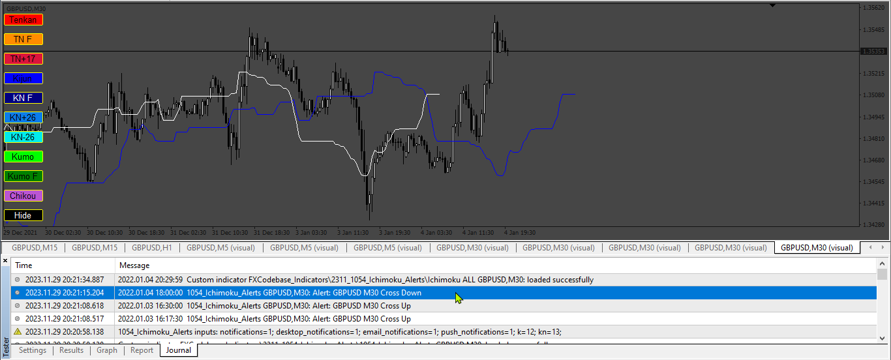

# Ichimoku_Alerts

> Source: https://fxcodebase.com/code/viewtopic.php?f=38&t=74389  
> Forum: 38 · Topic 74389 · 8 post(s)

---

## Ichimoku_Alerts

**Apprentice** · Thu Nov 30, 2023 2:01 pm

Based on the request.
[https://fxcodebase.com/code/viewtopic.php?f=27&p=153376](https://fxcodebase.com/code/viewtopic.php?f=27&p=153376)

 [Ichimoku_ALL.ex4](files/153495/Ichimoku_ALL.ex4)

 [Ichimoku_Alerts.mq4](files/153495/Ichimoku_Alerts.mq4)

---

## Re: Ichimoku_Alerts

**Mohamd** · Wed Jan 10, 2024 11:23 am

> **Apprentice wrote:**
>
>
> 1054.png
>
>
> Based on the request.
> [https://fxcodebase.com/code/viewtopic.php?f=27&p=153376](https://fxcodebase.com/code/viewtopic.php?f=27&p=153376)
>
>
> Ichimoku_ALL.ex4
>
>
>
>
> Ichimoku_Alerts.mq4

It is possible to create a green arrow on the candlestick for buy and a red arrow on the candlestick at the intersection of the two for sell lines.

---

## Re: Ichimoku_Alerts

**Mohamd** · Thu Jan 11, 2024 4:07 pm

It is possible to convert this ichnoku all ex4 indicator to mq4

---

## Re: Ichimoku_Alerts

**Apprentice** · Sat Jan 13, 2024 3:32 pm

We have added your request to the development list.
Development reference 68

---

## Re: Ichimoku_Alerts

**Mohamd** · Tue Feb 20, 2024 7:10 am

> **Mohamd wrote:**
> It is possible to convert this ichnoku all ex4 indicator to mq4

Hi, how long does it take?

---

## Re: Ichimoku_Alerts

**Mohamd** · Wed Mar 20, 2024 12:19 pm

Is it possible to make this trading view indicator for Metatrader 4?
([https://www.tradingview.com/script/buIv ... -screener/](https://www.tradingview.com/script/buIv13n6-Parsimaj-Banker-Free-depth-1-screener/))

---

## Re: Ichimoku_Alerts

**Apprentice** · Wed Mar 20, 2024 2:48 pm

We have added your request to the development list.
Development reference 236

---

## Re: Ichimoku_Alerts

**Apprentice** · Mon Apr 22, 2024 9:42 am

Same concept, trading view code is private.
[https://fxcodebase.com/code/viewtopic.php?f=38&t=74796](https://fxcodebase.com/code/viewtopic.php?f=38&t=74796)
