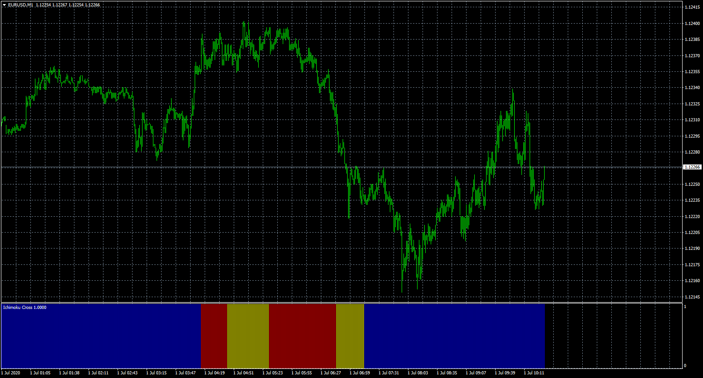
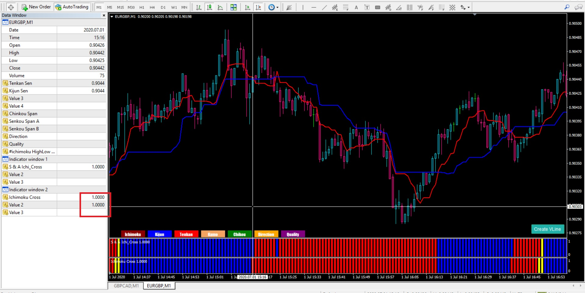
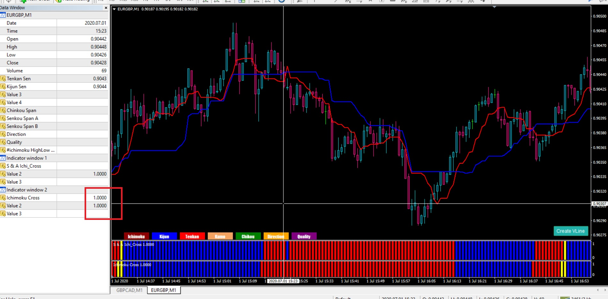
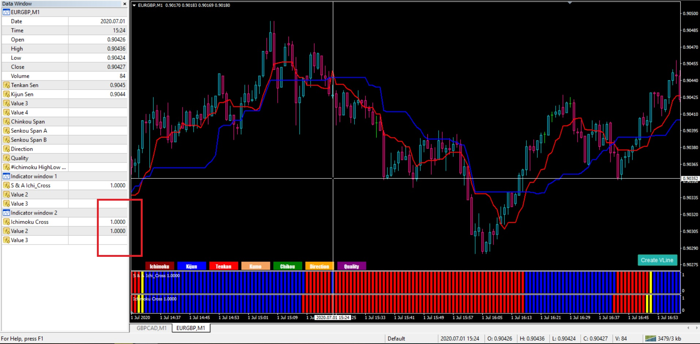

# Ichimoku_cross

> Source: https://fxcodebase.com/code/viewtopic.php?f=38&t=70108  
> Forum: 38 · Topic 70108 · 6 post(s)

---

## Ichimoku_cross

**Apprentice** · Wed Jul 01, 2020 4:23 am

Based on request.
[viewtopic.php?f=27&t=69798](https://fxcodebase.com/code/viewtopic.php?f=27&t=69798)

 [Ichimoku_cross.mq4](files/135498/Ichimoku_cross.mq4)

---

## Re: Ichimoku_cross

**zero999** · Wed Jul 01, 2020 1:23 pm

> **Apprentice wrote:**
>
>
> The attachment **eurusd-m1-fxcm-australia-pty.png** is no longer available
>
>
> Based on request.
> [viewtopic.php?f=27&t=69798](https://fxcodebase.com/code/viewtopic.php?f=27&t=69798)
>
>
> The attachment **eurusd-m1-fxcm-australia-pty.png** is no longer available

The indicator has a few small bugs

The ascending and descending color is shown in reverse

I set the indicator to the current time frame. The indicator has one candle and sometimes two candles repaint. In the data window, the repaint candles show two values.

 

 

 

If this bug can be turned on without repaint, and don't change when the candle closes, it's not a bad thing.
Because the cross is shown by a candle sooner . I don't know it's technically possible

Please create the timing section as follows

 

---

## Re: Ichimoku_cross

**Apprentice** · Thu Jul 02, 2020 3:09 am

Your request is added to the development list.
Development reference 1611.

---

## Re: Ichimoku_cross

**Apprentice** · Thu Jul 02, 2020 5:04 am

[Ichimoku_cross.mq4](files/135549/Ichimoku_cross.mq4)

Try this version.

---

## Re: Ichimoku_cross

**zero999** · Thu Jul 02, 2020 11:41 am

> **Apprentice wrote:**
>
>
> Ichimoku_cross.mq4
>
>
> Try this version.

It still repaint

---

## Re: Ichimoku_cross

**zero999** · Thu Jul 09, 2020 11:29 am

> **zero999 wrote:**
>
>
> > **Apprentice wrote:**
> >
> >
> > Ichimoku_cross.mq4
> >
> >
> > Try this version.
>
>
> It still repaint

Please check this
