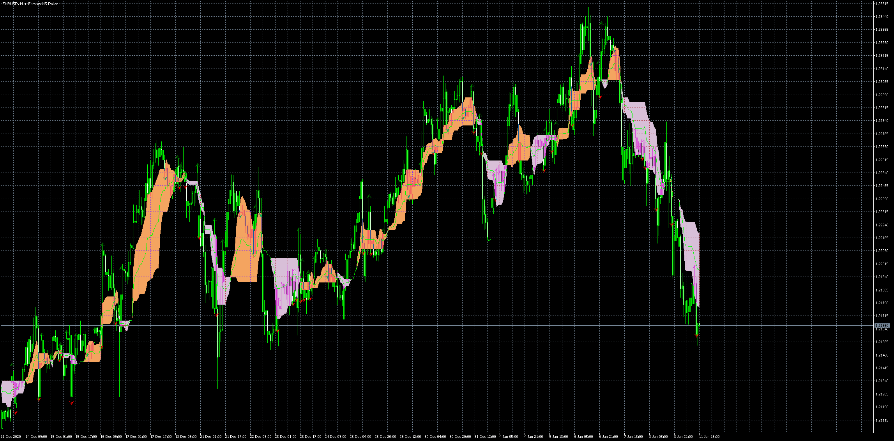

# Ichimoku Kijun Alert

> Source: https://fxcodebase.com/code/viewtopic.php?f=38&t=70808  
> Forum: 38 · Topic 70808 · 3 post(s)

---

## Ichimoku Kijun Alert

**Apprentice** · Mon Jan 11, 2021 6:01 am

Bases on request.
[viewtopic.php?f=17&t=70794](https://fxcodebase.com/code/viewtopic.php?f=17&t=70794)

 [Ichimoku Kijun Alert.mq5](files/140145/Ichimoku%20Kijun%20Alert.mq5)

 [Ichimoku Tenkan Alert.mq5](files/140145/Ichimoku%20Tenkan%20Alert.mq5)

---

## Re: Ichimoku Kijun Alert

**mohammad0032** · Sun Apr 18, 2021 10:02 am

Dear Team

i have request for this mq5 File same as below :

1-
we want to define more symbol in this file and when we drag this program to chart.
message alert show more symbols and more timeframe that we defined in indicator and don't show message alert for only current chart and current time frame. we want the indicator show alert for multi symbol or multi pair and multi time frame. we don't need dashboard. we need only message alert for multi symbol / multi time frame.

and show message alert same as below :

Multi Symbol / Multi Time Frame : Buy or Sell Signal

2-
we want define below line in this program :
one Line : Kijun Sen === Blue Color
one Line : Tenkan Sen === Red Color
one Line : Kijun Sen shifted +26 to right ===> Quality Line
one Line : Kijun Sen Shifted -26 to left ===> Direction Line
one Line : Tenkan Sen Shifted +17 to right ===> Tenk+17
one line : Senkou Span B shifted 0 ===>SpanB0
one Line : Senkou Span A Shifted 0 ===>SpanA0

3-
when tenkan sen cross kijun sen up and also chinkou span cross Direction Line Up and also tenk+17 cross Quality Line Up===> Buy Signal

Message Alert :
Multi Symbol / Multi Time Frame : Buy Signal , Tenk Cross Kijun up, Chinkou cross Dir up, Tenk+17 Cross Quality up

4 -
when tenkan sen cross kijun sen down and also chinkou span cross Direction Line down and also tenk+17 cross Quality Line down===> Sell Signal

Message Alert :
Multi Symbol / Multi Time Frame : Sell Signal , Tenk Cross Kijun down, Chinkou cross Dir down, Tenk+17 Cross Quality down

5-
when (tenkan sen = kijun sen = SpanB0 = SpanA0) and also (chinkou span cross Direction Line up) ===> Buy Signal

Message Alert :
Multi Symbol / Multi Time Frame : Buy Signal-Road Cross , Tenk = Kijun = Span A & B

6-
when (tenkan sen = kijun sen = SpanB0 = SpanA0) and also (chinkou span cross Direction Line down) ===> Sell Signal

Message Alert :
Multi Symbol / Multi Time Frame : Sell Signal-Road Cross , Tenk = Kijun = Span A & B

7-
when
(tenkan sen = kijun sen = SpanB0 = SpanA0) === > Time Frame = M15
(tenkan sen = kijun sen = SpanB0 = SpanA0) === > Time Frame = M30
(tenkan sen = kijun sen = SpanB0 = SpanA0) === > Time Frame = H1
 and also (chinkou span cross Direction Line up) ===> Buy Signal

Message Alert :
Multi Symbol / M15-M30-H1 : Buy Signal-Double Road Cross , Tenk = Kijun = Span A & B

8-
when
(tenkan sen = kijun sen = SpanB0 = SpanA0) === > Time Frame = M15
(tenkan sen = kijun sen = SpanB0 = SpanA0) === > Time Frame = M30
(tenkan sen = kijun sen = SpanB0 = SpanA0) === > Time Frame = H1
 and also (chinkou span cross Direction Line down) ===> Sell Signal

Message Alert :
Multi Symbol / M15-M30-H1 : Sell Signal-Double Road Cross , Tenk = Kijun = Span A & B

Note :
At the End we want Message Alert to be same as each section and is not same for all section
Message Alert of each section to be different.

Thank You

---

## Re: Ichimoku Kijun Alert

**Apprentice** · Mon Apr 19, 2021 2:09 am

Your request is added to the development list.
Development reference 370.
