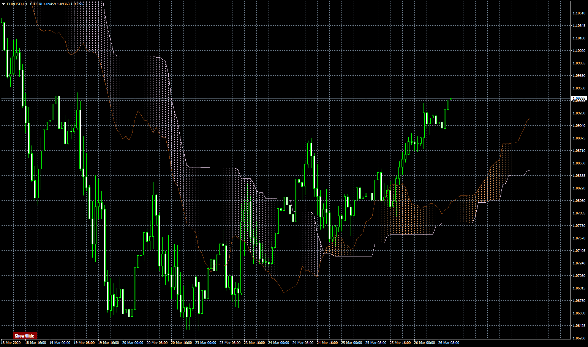
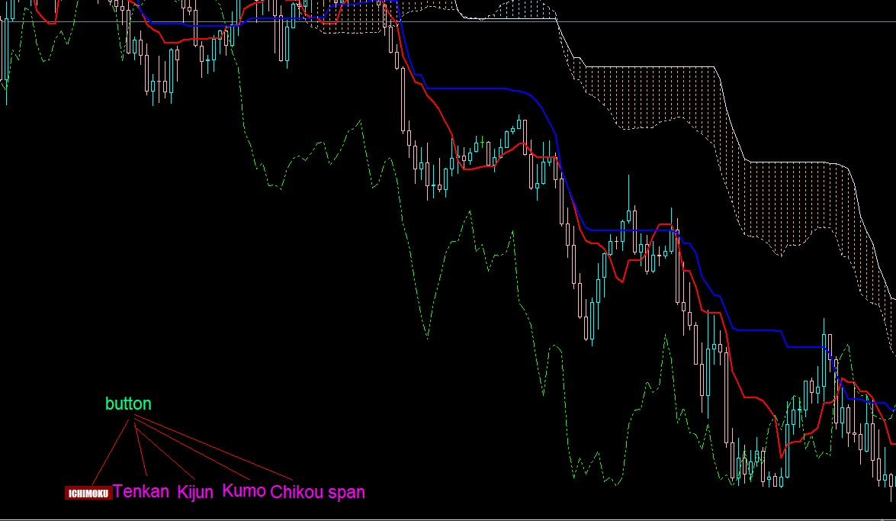
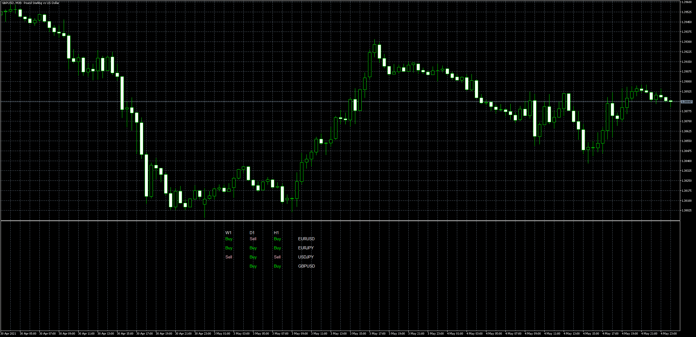

# Ichimoku mtf alerts

> Source: https://fxcodebase.com/code/viewtopic.php?f=38&t=69580  
> Forum: 38 · Topic 69580 · 36 post(s)

---

## Ichimoku mtf alerts

**Apprentice** · Thu Mar 26, 2020 6:08 am

Based on request.
[viewtopic.php?f=27&t=69553](https://fxcodebase.com/code/viewtopic.php?f=27&t=69553)

 [Ichimoku mtf alerts.mq4](files/132280/Ichimoku%20mtf%20alerts.mq4)

---

## Re: Ichimoku mtf alerts

**zero999** · Sun Mar 29, 2020 5:34 pm

Hi
Can you individually embed the Show / Hide button for all components of this indicator?
Like the picture below

 

---

## Re: Ichimoku mtf alerts

**Apprentice** · Mon Mar 30, 2020 6:36 am

Your request is added to the development list.
Development reference 960.

---

## Re: Ichimoku mtf alerts

**Apprentice** · Tue Mar 31, 2020 6:35 am

[Ichimoku mtf alerts.mq4](files/132415/Ichimoku%20mtf%20alerts.mq4)

Try this version.

---

## Re: Ichimoku mtf alerts

**zero999** · Tue Mar 31, 2020 10:54 am

The kumo and chiku buttons work together
Please insert a separate button for each

---

## Re: Ichimoku mtf alerts

**Apprentice** · Wed Apr 01, 2020 6:10 am

Your request is added to the development list.
Development reference 983.

---

## Re: Ichimoku mtf alerts

**zero999** · Wed Apr 08, 2020 7:09 am

The buttons do not work correctly
When I use the buttons and disable or activate some of these lines, by changing the time frame, all the settings are broken and the lines are erased.

---

## Re: Ichimoku mtf alerts

**Apprentice** · Thu Apr 09, 2020 5:10 am

Your request is added to the development list.
Development reference 1032.

---

## Re: Ichimoku mtf alerts

**Apprentice** · Thu Apr 09, 2020 7:38 am

[Ichimoku mtf alerts.mq4](files/132713/Ichimoku%20mtf%20alerts.mq4)

Try this version.

---

## Re: Ichimoku mtf alerts

**zero999** · Fri Apr 10, 2020 3:24 pm

> **Apprentice wrote:**
>
>
> Ichimoku mtf alerts.mq4
>
>
> Try this version.

Awesome
you are the best
thank you

---

## Re: Ichimoku mtf alerts

**zero999** · Fri Apr 10, 2020 4:00 pm

> **Apprentice wrote:**
>
>
> Ichimoku mtf alerts.mq4
>
>
> Try this version.

I tried to set a separate color for each button, but I couldn't find the code for it
i want ichimoku button color be darkred
tenkan colore =red
kijun=blue
chikou= green
kumo=sandy brown

---

## Re: Ichimoku mtf alerts

**Apprentice** · Sun Apr 12, 2020 9:53 am

Your request is added to the development list.
Development reference 1052.

---

## Re: Ichimoku mtf alerts

**Apprentice** · Mon Apr 20, 2020 7:46 am

[Ichimoku mtf alerts.mq4](files/132982/Ichimoku%20mtf%20alerts.mq4)

---

## Re: Ichimoku mtf alerts

**zero999** · Thu Apr 23, 2020 3:36 pm

Dear Apprentice
Hello
I need two more lines for this indicator
direction line and quality line
direction line = the same kijun that is given back shift. The shift value must be adjustable. Button color: orange
quality line = kijun is the same as kijun given to the prefix. The shift value must be adjustable. Button color: purple

thanks

---

## Re: Ichimoku mtf alerts

**Apprentice** · Fri Apr 24, 2020 12:59 pm

Your request is added to the development list.
Development reference 1129.

---

## Re: Ichimoku mtf alerts

**Apprentice** · Tue Apr 28, 2020 10:43 am

[Ichimoku mtf alerts.mq4](files/133299/Ichimoku%20mtf%20alerts.mq4)

Try this version.

---

## Re: Ichimoku mtf alerts

**zero999** · Thu Apr 30, 2020 2:24 pm

THANK YOU

---

## Re: Ichimoku mtf alerts

**zero999** · Sat Jul 04, 2020 1:02 pm

> **Apprentice wrote:**
>
>
> Ichimoku mtf alerts.mq4
>
>
> Try this version.

Please add Magic Number to this indicator so that I can run the indicator on a chart more than once.

---

## Re: Ichimoku mtf alerts

**Apprentice** · Sun Jul 05, 2020 1:15 pm

Your request is added to the development list.
Development reference 1634.

---

## Re: Ichimoku mtf alerts

**Apprentice** · Mon Jul 06, 2020 2:03 pm

[Ichimoku mtf alerts.mq4](files/135682/Ichimoku%20mtf%20alerts.mq4)

Try this version.

---

## Re: Ichimoku mtf alerts

**zero999** · Mon Jul 06, 2020 2:09 pm

> **Apprentice wrote:**
>
>
> The attachment **Ichimoku mtf alerts.mq4** is no longer available
>
>
> Try this version.

It's very strange
And it doesn't work

---

## Re: Ichimoku mtf alerts

**zero999** · Thu Jul 09, 2020 11:28 am

> **zero999 wrote:**
>
>
> > **Apprentice wrote:**
> >
> >
> > Ichimoku mtf alerts.mq4
> >
> >
> > Try this version.
>
>
> It's very strange
> And it doesn't work

Please check this

---

## Re: Ichimoku mtf alerts

**zero999** · Wed Aug 05, 2020 10:56 am

up

---

## Re: Ichimoku mtf alerts

**Frank8093** · Wed Apr 21, 2021 5:52 am

> **Apprentice wrote:**
>
>
> Ichimoku mtf alerts.mq4
>
>
> Try this version.

Dear Team
The first thank you for your cooperation.
I have request for this mql file (ichimoku mtf) :

Can you add multi time frame alerts to this indicators.
I explain this by one example.
I drag the ichimoku mtf indicator to the for example eurusd chart.
We want when for example cross tenkan and kijun occured or cross price with kumo occured on multi time frame of eurusd chart.send message alert or send notifications of all multi time frame of

Another request if add the multi symbol to this indicator for search and alerts it’s very very good indicator.

Many many thanks
Best Regards

---

## Re: Ichimoku mtf alerts

**Apprentice** · Wed Apr 21, 2021 11:35 am

Your request is added to the development list.
Development reference 391.

---

## Re: Ichimoku mtf alerts

**Apprentice** · Tue Apr 27, 2021 12:09 pm

Try this version.
[viewtopic.php?f=38&t=70773](https://fxcodebase.com/code/viewtopic.php?f=38&t=70773)

---

## Re: Ichimoku mtf alerts

**Frank8093** · Thu Apr 29, 2021 4:54 am

> **Apprentice wrote:**
>
>
> Ichimoku mtf alerts.mq4
>
>
> Try this version.

Hi
Excuse me, first thank you for your best Cooperation.
Could you convert this file for Mq5 (meta trader 5)???
I want the ichimoku mtf chart with show / hide button for mq5 same as this file for mq4.

Many thanks
Regards

---

## Re: Ichimoku mtf alerts

**Apprentice** · Thu Apr 29, 2021 11:55 pm

Your request is added to the development list.
Development reference 423.

---

## Re: Ichimoku mtf alerts

**Apprentice** · Tue May 04, 2021 4:16 pm

 [Ichimoku_Scanner_Tenkan_Kijun.mq5](files/141882/Ichimoku_Scanner_Tenkan_Kijun.mq5)

---

## Re: Ichimoku mtf alerts

**Frank8093** · Wed May 05, 2021 11:48 am

> **Apprentice wrote:**
>
>
> gbpusd-m30-metaquotes-software-corp-2.png
>
>
>
>
> Ichimoku_Scanner_Tenkan_Kijun.mq5

Hi
Excuse me, this file isn’t our request.
As you know in above post, we request the ichimoku mtf chart with show hide button for mq5 (mt5)
I want the ichimoku mtf chart with show / hide button for mq5 same as this file for mq4.

Many thanks
Regards

---

## Re: Ichimoku mtf alerts

**Apprentice** · Fri May 07, 2021 4:08 am

Your request is added to the development list.
Development reference 452.

---

## Re: Ichimoku mtf alerts

**Frank8093** · Sun Sep 12, 2021 11:01 am

> **Apprentice wrote:**
>
>
> gbpusd-m30-metaquotes-software-corp-2.png
>
>
>
>
> Ichimoku_Scanner_Tenkan_Kijun.mq5

Dear Mario

Have a good Time.

Can you add once alert per signal for this scanner.
I don’t need alert once per bar (candle) or once per time.
I need alert once per signal.

Thank you
Regards
Frank

---

## Re: Ichimoku mtf alerts

**Apprentice** · Mon Sep 13, 2021 11:37 am

Your request is added to the development list.
Development reference 815.

---

## Re: Ichimoku mtf alerts

**Apprentice** · Thu Sep 16, 2021 8:13 am

It is already doing that.

---

## Re: Ichimoku mtf alerts

**IlY11s** · Tue Mar 08, 2022 9:40 am

Can you please add some alerts whenever senko span B - A Point at the same direction as the price in every close Bar ??

---

## Re: Ichimoku mtf alerts

**Apprentice** · Thu Jan 30, 2025 5:23 am

Already completed: [https://fxcodebase.com/code/viewtopic.p ... 05#p129505](https://fxcodebase.com/code/viewtopic.php?p=129505#p129505)
