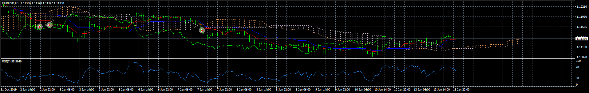
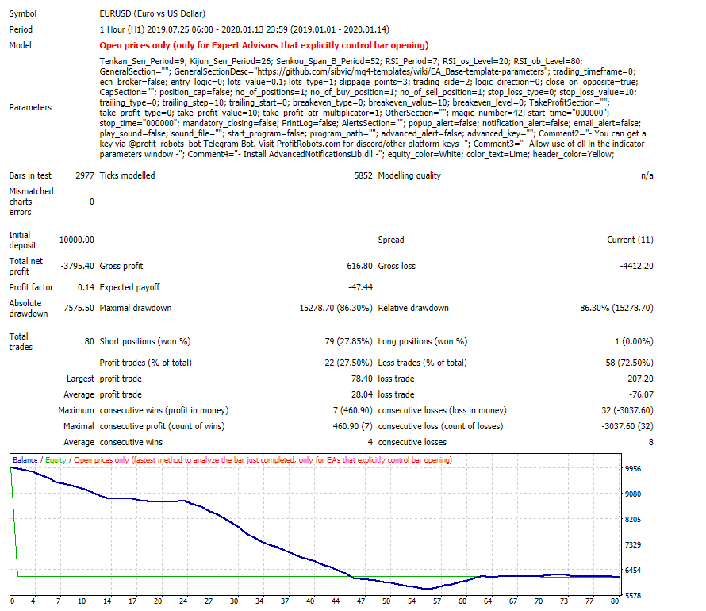

# ichimoku rsi ea

> Source: https://fxcodebase.com/code/viewtopic.php?f=38&t=69339  
> Forum: 38 · Topic 69339 · 13 post(s)

---

## ichimoku rsi ea

**Apprentice** · Wed Jan 22, 2020 5:17 pm

 

Based on request.
[viewtopic.php?f=27&p=130824](https://fxcodebase.com/code/viewtopic.php?f=27&p=130824)

 [ichimoku rsi ea.mq4](files/130855/ichimoku%20rsi%20ea.mq4)

---

## Re: ichimoku rsi ea

**tsholo13** · Thu Jan 23, 2020 3:06 am

I really appreciate all efforts but this doesnt meet my requirements
According to picture you showed ichimoku opened sell positions but I do not see overbought on RSI

Fore sell position price closed below cloud and RSI Must be overbought,if this is not met No Trade
For Buy position price closed above cloud and RSI Must be oversold,if this is not met No Trade

---

## Re: ichimoku rsi ea

**Apprentice** · Thu Jan 23, 2020 11:45 am

Your request is added to the development list.
Development reference 582.

---

## Re: ichimoku rsi ea

**Apprentice** · Fri Jan 24, 2020 7:59 am

[ichimoku_rsi_ea.mq4](files/130898/ichimoku_rsi_ea.mq4)

Try this version.

---

## Re: ichimoku rsi ea

**tsholo13** · Fri Jan 24, 2020 10:58 am

No change on the code same as previous one you did
Perhaps you didnt want to waste your time helping me with requirements I asked for

---

## Re: ichimoku rsi ea

**Apprentice** · Tue Jan 28, 2020 1:44 pm

There is a change in the conditions

---

## Re: ichimoku rsi ea

**tsholo13** · Fri Jan 31, 2020 1:04 am

One more request
The same rules please do a scanner all pairs different Timeframes
And please remove the orders,I only want alerts(Pop up,notifications)

Thank you

---

## Re: ichimoku rsi ea

**Apprentice** · Sun Feb 02, 2020 7:19 am

Your request is added to the development list.
Development reference 621.

---

## Re: ichimoku rsi ea

**Apprentice** · Mon Feb 03, 2020 6:41 am

[ichimoku rsi scanner.mq4](files/131044/ichimoku%20rsi%20scanner.mq4)

Try this version.

---

## Re: ichimoku rsi ea

**SmithAlfred** · Tue Aug 03, 2021 8:07 am

Hello,

Could you please create one indicator for MT4 whiches possible to put the Ichimoku into the window of RSI please ?

Thank you,

---

## Re: ichimoku rsi ea

**Apprentice** · Wed Aug 04, 2021 4:53 am

Your request is added to the development list.
Development reference 713.

---

## Re: ichimoku rsi ea

**Apprentice** · Mon Aug 09, 2021 7:48 am

Something like this?
[https://fxcodebase.com/code/viewtopic.php?f=38&t=71405](https://fxcodebase.com/code/viewtopic.php?f=38&t=71405)

Something like this, we’re not entirely sure what’s required.

---

## Re: ichimoku rsi ea

**SmithAlfred** · Tue Aug 10, 2021 8:03 am

Yes, thank you very much for work !
