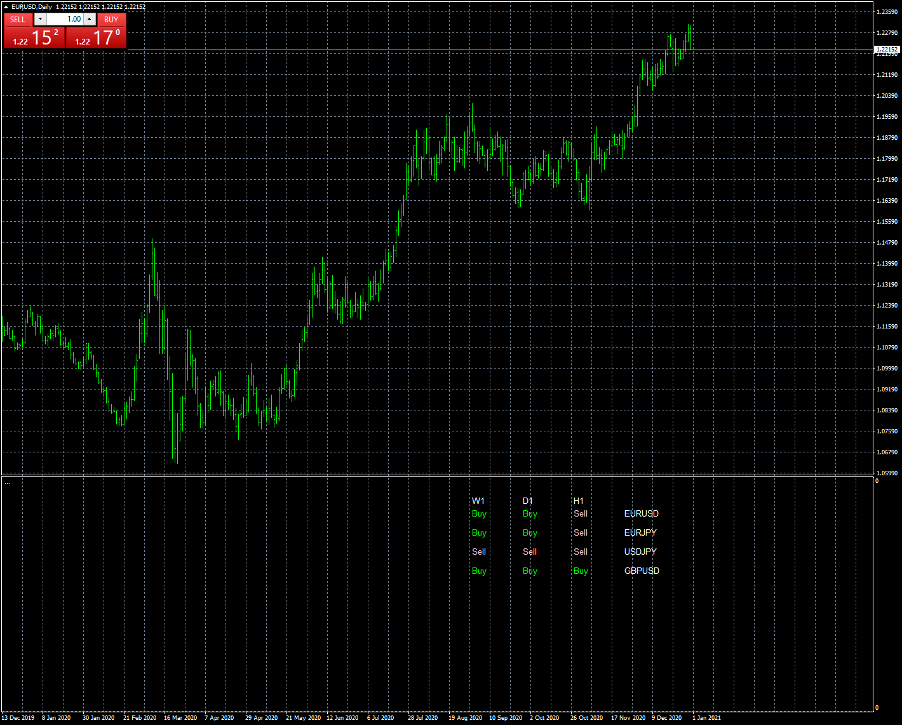

# Ichimoku scanner kumo bullish bearish

> Source: https://fxcodebase.com/code/viewtopic.php?f=38&t=70771  
> Forum: 38 · Topic 70771 · 15 post(s)

---

## Ichimoku scanner kumo bullish bearish

**Apprentice** · Sun Jan 03, 2021 5:55 am

Based on request.
[viewtopic.php?f=27&t=70763](https://fxcodebase.com/code/viewtopic.php?f=27&t=70763)

 [Ichimoku scanner kumo bullish bearish.mq4](files/139939/Ichimoku%20scanner%20kumo%20bullish%20bearish.mq4)

---

## Re: Ichimoku scanner kumo bullish bearish

**bibeckman** · Sun Jan 03, 2021 2:53 pm

It's okay, I've found how to do it. I just have to put the same name of my pairs as my brokers name ex: EURUSD for my broker is EURUSDi.

---

## Re: Ichimoku scanner kumo bullish bearish

**bibeckman** · Tue Apr 13, 2021 12:32 pm

Very good job but how can i add aothers pairs it's limited at 30 and i would like to add more ???

---

## Re: Ichimoku scanner kumo bullish bearish

**Apprentice** · Tue Apr 13, 2021 1:12 pm

Your request is added to the development list.
Development reference 350.

---

## Re: Ichimoku scanner kumo bullish bearish

**mohammad0032** · Wed Apr 14, 2021 4:35 am

Dear Sir
excuse me i have two request for this indicator :

1- when the value of senkou span A & B in 2 or more timeframe are same (overlap).
show by (OK) in dashboard and show alerts for multipairs.

Best Regards

---

## Revise: Ichimoku scanner kumo bullish bearish

**mohammad0032** · Wed Apr 14, 2021 10:11 am

Dear Sir

The First Thank you for best cooperation.

Excuse Me Sir, I have 2 or 3 request from you for this Program :

1- when the Senkou Span A & B are Same (Overlap) in one Timeframe show By ((RC A & B)) in Dashboard for Multi Pair.

Also Show related Alerts of ((RC A & B)) in Message Alert for Item 1 same as below :

ALL Specified Symbol , Time Frame : ((RC)) in SPAN A & SPAN B.

2- when the Senkou Span A & B are Same (Overlap) in TWO or More Timeframe For Example TimeFrame1 = M15, TimeFrame1= M30,TimeFrame1 = H1 show By ((RC2 OR RC3)) in Dashboard for Multi Pair. RC2 Means SPAN A & B are same in 2 Time Frame and etc.

Also Show related Alerts of ((RC2 OR RC3)) in Message Alert for Item 2 same as below :

ALL Specified Symbol ,TimeFrame1, TimeFrame2, TimeFrame3 , ... : ((RC2 OR RC3)) in SPAN A & SPAN B.

Thanks For Your Best Cooperation.
Best Regards

---

## Re: Ichimoku scanner kumo bullish bearish

**Apprentice** · Thu Apr 15, 2021 4:59 am

Your request is added to the development list.
Development reference 355.

---

## Re: Ichimoku scanner kumo bullish bearish

**Apprentice** · Thu Apr 15, 2021 5:16 am

bibeckman
There is no limit in the indicator.

---

## Re: Ichimoku scanner kumo bullish bearish

**Apprentice** · Sun Apr 18, 2021 2:46 am

[Ichimoku scanner kumo bullish bearish.mq4](files/141557/Ichimoku%20scanner%20kumo%20bullish%20bearish.mq4)

Try this version.

---

## Re: Ichimoku scanner kumo bullish bearish

**mohammad0032** · Sun Apr 18, 2021 8:31 am

Hi Team

The First Thanks for your team for programming.

For Your information my request is compare with the File.

Please see the attached Picture.

i explain the request on it.

Best Regards.

Thanks For Your Attention

---

## Re: Ichimoku scanner kumo bullish bearish

**Frank8093** · Sun Apr 18, 2021 10:12 am

Dear Team

i have request for this mq4 File same as below :

1-
we want to define more symbol in this file and when we drag this program to chart.
message alert show more symbols and more timeframe that we defined in indicator and don't show message alert for only current chart and current time frame. we want the indicator show alert for multi symbol or multi pair and multi time frame. we need message alert for multi symbol / multi time frame.

2-
we want define below line in this program :
one Line : Kijun Sen shifted +26 to right ===> Quality Line
one Line : Kijun Sen Shifted -26 to left ===> Direction Line
one Line : Tenkan Sen Shifted +17 to right ===> Tenk+17
one line : Senkou Span B shifted 0 ===>SpanB0
one Line : Senkou Span A Shifted 0 ===>SpanA0

3-
when tenkan sen cross kijun sen up and also chinkou span cross Direction Line Up and also tenk+17 cross Quality Line Up===> Buy Signal

Message Alert :
Multi Symbol / Multi Time Frame : Buy Signal , Tenk Cross Kijun up, Chinkou cross Dir up, Tenk+17 Cross Quality up

4 -
when tenkan sen cross kijun sen down and also chinkou span cross Direction Line down and also tenk+17 cross Quality Line down===> Sell Signal

Message Alert :
Multi Symbol / Multi Time Frame : Sell Signal , Tenk Cross Kijun down, Chinkou cross Dir down, Tenk+17 Cross Quality down

5-
when (SpanB0 = SpanA0) and also (chinkou span cross Direction Line up) ===> Buy Signal

Message Alert :
Multi Symbol / Multi Time Frame : Buy Signal-Road Cross , Span A & B

6-
when (SpanB0 = SpanA0) and also (chinkou span cross Direction Line down) ===> Sell Signal

Message Alert :
Multi Symbol / Multi Time Frame : Sell Signal-Road Cross , Span A & B

7-
when
(SpanB0 = SpanA0) === > Time Frame = M15
(SpanB0 = SpanA0) === > Time Frame = M30
(SpanB0 = SpanA0) === > Time Frame = H1
 and also (chinkou span cross Direction Line up) ===> Buy Signal

Message Alert :
Multi Symbol / M15-M30-H1 : Buy Signal-Multi Road Cross , Span A & B

8-
when
(SpanB0 = SpanA0) === > Time Frame = M15
(SpanB0 = SpanA0) === > Time Frame = M30
(SpanB0 = SpanA0) === > Time Frame = H1
 and also (chinkou span cross Direction Line down) ===> Sell Signal

Message Alert :
Multi Symbol / M15-M30-H1 : Sell Signal-Multi Road Cross , Span A & B

Note :
At the End we want Message Alert to be same as each section and is not same for all section
Message Alert of each section to be different.

Thank You
B/R

---

## Re: Ichimoku scanner kumo bullish bearish

**Apprentice** · Mon Apr 19, 2021 2:06 am

Your request is added to the development list.
Development reference 369.

---

## Re: Ichimoku scanner kumo bullish bearish

**bibeckman** · Sat Apr 24, 2021 3:22 am

Look i can't add more

---

## Re: Ichimoku scanner kumo bullish bearish

**bibeckman** · Sat Apr 24, 2021 3:29 am

can we have it in a floating window

---

## Re: Ichimoku scanner kumo bullish bearish

**Frank8093** · Fri Sep 09, 2022 10:59 am

Dear Mario
can we have it in a floating window

Regards
