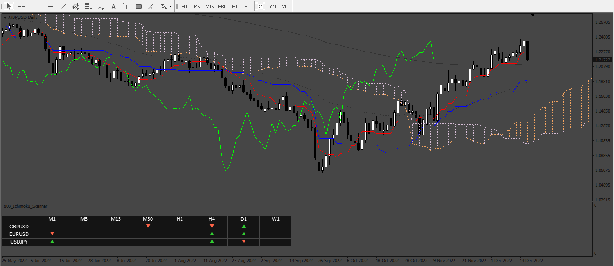
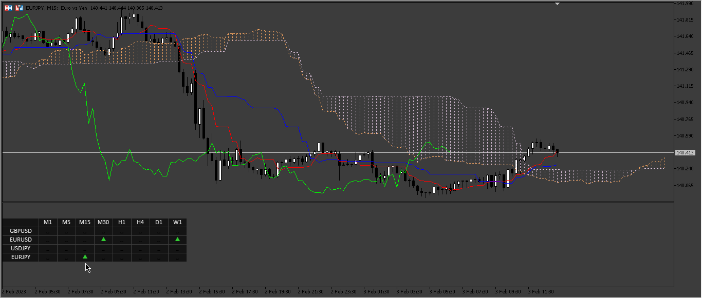
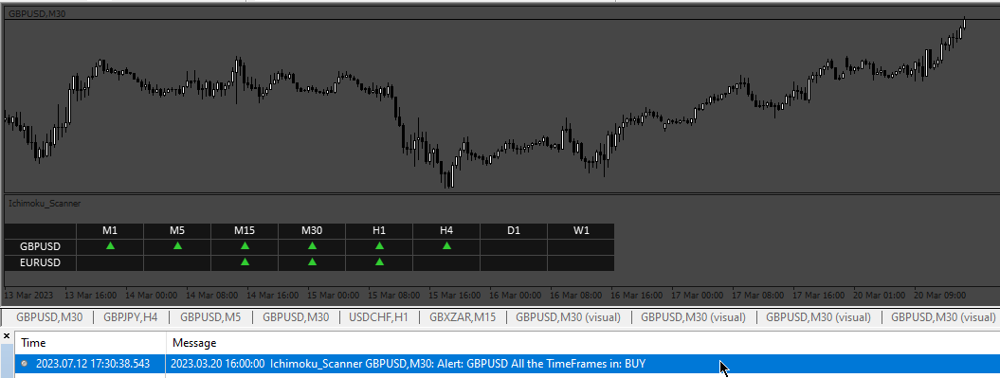
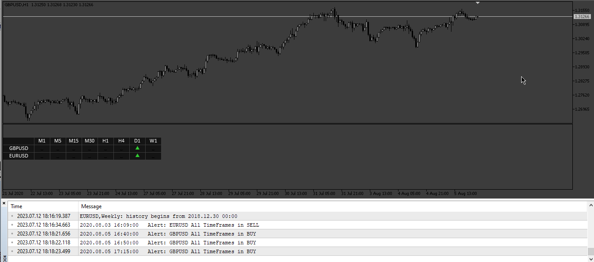
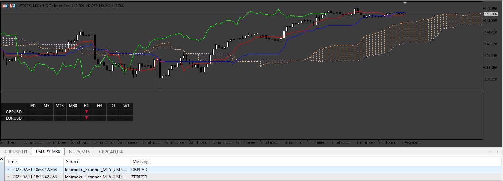

# Ichimoku_Scanner

> Source: https://fxcodebase.com/code/viewtopic.php?f=38&t=73051  
> Forum: 38 · Topic 73051 · 10 post(s)

---

## Ichimoku_Scanner

**Apprentice** · Fri Dec 16, 2022 10:45 am

Based on the request.
[https://fxcodebase.com/code/viewtopic.php?f=38&p=148591](https://fxcodebase.com/code/viewtopic.php?f=38&p=148591)

 [Ichimoku_Scanner.mq4](files/148692/Ichimoku_Scanner.mq4)

 

 [Ichimoku_Scanner_MT5.mq5](files/148692/Ichimoku_Scanner_MT5.mq5)

---

## Re: Ichimoku_Scanner

**wems007** · Fri Dec 16, 2022 10:42 pm

MT5 version please

---

## Re: Ichimoku_Scanner

**Apprentice** · Sun Dec 18, 2022 3:55 am

We have added your request to the development list.
Development reference 840.

---

## Re: Ichimoku_Scanner

**Apprentice** · Sun Feb 05, 2023 3:47 am

MT5 version added.

---

## Re: Ichimoku_Scanner

**Frank8093** · Mon Jul 10, 2023 6:20 am

Dear Mario
have a good day
send notification doesn't work.
can you revise the code

many many thanks

---

## Re: Ichimoku_Scanner

**Apprentice** · Wed Jul 12, 2023 10:51 am

We have added your request to the development list.
Development reference 607.

---

## Re: Ichimoku_Scanner

**Apprentice** · Mon Jul 17, 2023 2:28 pm

 

 [Ichimoku_Scanner.mq4](files/151667/Ichimoku_Scanner.mq4)

 [Ichimoku_Scanner_MT5.mq5](files/151667/Ichimoku_Scanner_MT5.mq5)

---

## Re: Ichimoku_Scanner

**Frank8093** · Thu Jul 20, 2023 2:50 pm

Dear Mario

Have a good day

send notification in MT5 doesn't work again.
send below message :
2023.07.20 23:15:17.534	Ichimoku_Scanner_MT5 (USDJPY,M30)cannot load indicator 'Ichimoku Kinko Hyo' [4302]

can you check the code again or help me to solve this problem.

many many thanks

---

## Re: Ichimoku_Scanner

**Apprentice** · Tue Jul 25, 2023 6:20 am

We have added your request to the development list.
Development reference 648.

---

## Re: Ichimoku_Scanner

**Apprentice** · Tue Aug 01, 2023 5:03 pm

I am using the indicator that comes by default with the platform,
probably have to update the platform,
otherwise, you can try to install the attached file in the folder “MQL5/Include/Indicators”

 [Indicators.rar](files/151877/Indicators.rar)
