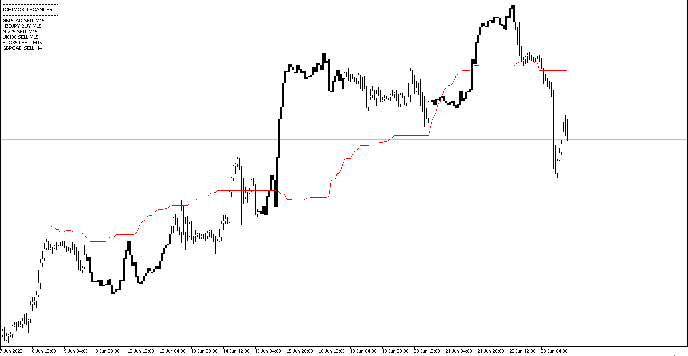

# Ichimoku_Scanner

> Source: https://fxcodebase.com/code/viewtopic.php?f=38&t=73870  
> Forum: 38 · Topic 73870 · 5 post(s)

---

## Ichimoku_Scanner

**Apprentice** · Mon Jun 26, 2023 2:41 pm

Based on the request.
[https://fxcodebase.com/code/viewtopic.php?f=27&p=151333](https://fxcodebase.com/code/viewtopic.php?f=27&p=151333)

 [Ichimoku_Scanner.mq5](files/151417/Ichimoku_Scanner.mq5)

---

## Re: Ichimoku_Scanner

**Frank8093** · Fri Aug 04, 2023 11:48 am

Dear Mario

Have a good day

can you add the Expert of this Indicator.
also we want to set the number of position which that include below items :
(1- set the total Num of buy and sell position 2- set the Num of Buy Position 3-set the Num of Sell Position 4- set the Volume of position 5- set the take profit 6- set the stop loss )

Thanks for your best cooperation

Many Many Thanks

---

## Re: Ichimoku_Scanner

**Frank8093** · Sat Aug 05, 2023 1:10 pm

Dear Mario

Have a good day

Can you provide/make expert of this file in MT5.

Also we want to set the below items for position :

1- Set the Total Number of Buy/Sell Position.

2- Set the Number of Sell Position.

3- Set the Number of Buy Position.

Note 1: the sum of item 2 & 3 should be equal the Item 1.

4- Set the Volume for each position.

Note 2 : when the position for one pair has been opened the another position for this pair doesn’t open again and this position must be closed and another position open.

Many Many Thanks

Regards
Frank

---

## Re: Ichimoku_Scanner

**Apprentice** · Tue Aug 08, 2023 3:14 am

We have added your request to the development list.
Development reference 675.

---

## Re: Ichimoku_Scanner

**Frank8093** · Fri Aug 09, 2024 5:08 am

> **Apprentice wrote:**
> We have added your request to the development list.
> Development reference 675.

Dear Sir

This request is ok or not???

Regards
