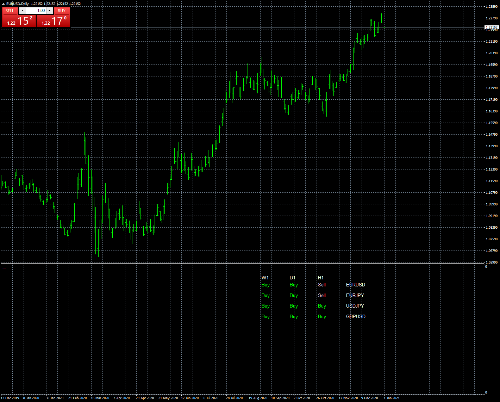

# Ichimoku scanner tenkan kijun

> Source: https://fxcodebase.com/code/viewtopic.php?f=38&t=70773  
> Forum: 38 · Topic 70773 · 5 post(s)

---

## Ichimoku scanner tenkan kijun

**Apprentice** · Sun Jan 03, 2021 6:12 am

Based on request.
[viewtopic.php?f=27&t=70768](https://fxcodebase.com/code/viewtopic.php?f=27&t=70768)

 [Ichimoku scanner tenkan kijun.mq4](files/139945/Ichimoku%20scanner%20tenkan%20kijun.mq4)

---

## Re: Ichimoku scanner tenkan kijun

**bibeckman** · Sun Jul 31, 2022 3:07 pm

Hello it's possibe to change on scanner the board

« Sell » by « T/K>K »
and
« Buy » by « T/K<K »

Thanks you

---

## Re: Ichimoku scanner tenkan kijun

**bibeckman** · Tue Sep 06, 2022 4:57 pm

Possible ?

---

## Re: Ichimoku scanner tenkan kijun

**Apprentice** · Thu Sep 08, 2022 2:08 am

We have added your request to the development list.
Development reference 545.

---

## Re: Ichimoku scanner tenkan kijun

**Apprentice** · Fri Sep 23, 2022 9:39 am

[Ichimoku_scanner_tenkan_kijun_v2.mq4](files/147538/Ichimoku_scanner_tenkan_kijun_v2.mq4)

Try this version.
