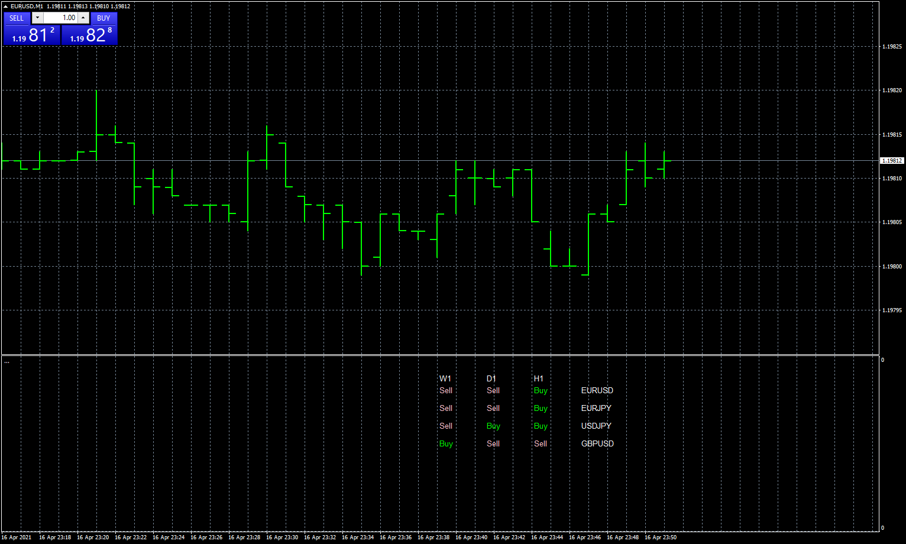

# Ichimoku_scanner_tenkan_price

> Source: https://fxcodebase.com/code/viewtopic.php?f=38&t=71100  
> Forum: 38 · Topic 71100 · 11 post(s)

---

## Ichimoku_scanner_tenkan_price

**Apprentice** · Sun Apr 18, 2021 2:31 am

Based on the request.
[https://fxcodebase.com/code/viewtopic.p ... 80#p141480](https://fxcodebase.com/code/viewtopic.php?f=27&p=141480#p141480)

 [Ichimoku_scanner_tenkan_price.mq4](files/141550/Ichimoku_scanner_tenkan_price.mq4)

---

## Re: Ichimoku_scanner_tenkan_price

**bibeckman** · Sat Apr 24, 2021 3:20 am

Thanks you

---

## Re: Ichimoku_scanner_tenkan_price

**bibeckman** · Sat Apr 24, 2021 3:28 am

can we have it in a floating window

---

## Re: Ichimoku_scanner_tenkan_price

**Apprentice** · Mon Apr 26, 2021 2:16 am

Your request is added to the development list.
Development reference 409.

---

## Re: Ichimoku_scanner_tenkan_price

**Apprentice** · Sat May 01, 2021 5:24 am

As a background behind indicator output?
Can you show a similar implementation?

---

## Re: Ichimoku_scanner_tenkan_price

**bibeckman** · Tue May 04, 2021 12:32 am

Like this on

---

## Re: Ichimoku_scanner_tenkan_price

**bibeckman** · Sun Jul 31, 2022 3:14 pm

Hello it's possibe to change on scanner the board

« Sell » by « T/K>K »
and
« Buy » by « T/K<K »

Thanks you

---

## Re: Ichimoku_scanner_tenkan_price

**Frank8093** · Fri Sep 09, 2022 11:00 am

Dear Mario

Can you show in floating window for move window and add all pairs?

Regards

---

## Re: Ichimoku_scanner_tenkan_price

**Apprentice** · Sat Sep 10, 2022 4:06 am

We have added your request to the development list.
Development reference 549.

---

## Re: Ichimoku_scanner_tenkan_price

**bibeckman** · Thu Jan 05, 2023 5:18 pm

Hi it's possible to change "BUY" by "OK" and "SELL" BY "-"

Thanks you

---

## Re: Ichimoku_scanner_tenkan_price

**Apprentice** · Wed Jan 03, 2024 5:28 am

Task 549.

 [Ichimoku_Scanner.mq4](files/153908/Ichimoku_Scanner.mq4)
